# Informe de arquitectura — BusetasApp (backend del prototipo) — v2 revisada

> **Estado:** propuesta técnica **pendiente de aprobación humana**. Es una revisión del informe `informe_arquitectura (1).md` (generado el 2026-10-12) corregida contra las 13 SPEC y el archivo de historias de usuario. Todo lo marcado como **DECISIÓN PROPUESTA** debe ser confirmado por el equipo antes de darse por cerrado.

| Campo | Valor |
|---|---|
| Revisión | 2026-10-13 |
| Alcance | **Prototipo** del backend (API REST). El frontend es otro componente y queda fuera de este documento |
| Restricción dura | Solo tecnologías gratuitas o de código abierto. Base de datos: Supabase |
| Arquitectura | Hexagonal ligera (puertos y adaptadores) sobre un **monolito modular** |
| Fuentes | SPEC-001 a SPEC-013, `historias_usuario (12).txt`, informe original |

---

## 0. Reglas para los agentes de desarrollo (leer primero)

Este documento es la **fuente de verdad** del backend. Para evitar alucinaciones:

1. **No inventes.** Si algo no está en este documento (endpoint, tabla, columna, parámetro, dependencia), no lo crees. Deja un comentario `// PENDIENTE(decisión): <qué falta>` y repórtalo al final de tu tarea.
2. **No agregues dependencias** fuera de las listadas en la sección 4.
3. **Regla de dependencias:** `dominio` no importa nada de `aplicacion` ni de `infraestructura`, ni librerías externas (ni `express`, ni `@supabase/supabase-js`). `aplicacion` solo importa de `dominio`. `infraestructura` puede importar de ambas. El único archivo que conecta todo es `src/composicion.js`.
4. **Un caso de uso = una función** `async function nombreDelCasoDeUso(dependencias) => (entrada) => salida`. Recibe sus puertos por inyección, recibe y devuelve DTOs planos. No conoce HTTP.
5. **Nombres en español, legibles.** Identificadores en `camelCase` (`distanciaAvisoMetros`, `calcularEta`), archivos en `kebab-case` (`calcular-eta.js`). Sin abreviaturas crípticas. Comentarios solo donde expliquen el porqué.
6. **Todo dato que entra por HTTP se valida con `zod`** en el adaptador de entrada. El dominio asume datos ya válidos, pero aplica sus propias reglas de negocio.
7. **Errores:** el dominio y los casos de uso lanzan los errores tipados de `dominio/errores.js` (sección 9.3). Solo el middleware de errores los traduce a HTTP.
8. **Nunca registres** en logs credenciales, tokens, cabecera `Authorization`, correos ni datos personales (RNF-01).
9. **Escrituras sobre recursos editables** usan control de versión optimista (sección 13.2).
10. **Construye en el orden de la sección 17** y escribe pruebas unitarias del caso de uso con repositorios en memoria antes de escribir el adaptador de Supabase.
11. **Fuera de alcance** (SPEC §14): pagos y manejo de dinero, transporte fuera de Manizales y Villamaría, planillas, nómina y recaudo, taxis e informales. No modeles nada de eso (el informe original tenía una entidad `BOLETO`: se eliminó).

---

## 1. Veredicto y resumen

**Veredicto:** la arquitectura hexagonal es defendible para este proyecto, **con ajustes**. La mantenibilidad y la testabilidad dependen de aislar los *externos reemplazables* (Supabase, geocodificación, notificaciones push, lectura de Excel, fuente de posiciones GPS), no de la cantidad de roles de usuario (los roles son autorización, no arquitectura).

Se adopta **hexagonal ligera**: puertos solo donde hay un externo real o una lógica que se quiere probar de forma aislada. No se crean puertos por cada consulta trivial.

### 1.1 Qué cambió respecto al informe original

| # | Problema del informe original | Corrección en esta versión |
|---|---|---|
| 1 | La fuente de datos GPS era una caja sin origen y chocaba con BR-06 (los conductores no tienen acceso) | Se define el **dispositivo de la buseta con token propio** (no es un usuario) y un **simulador GPS** para el prototipo (D-01, ADR-003) |
| 2 | ER con entidad `BOLETO` (fuera de alcance) y sin conductores, rodamiento, avisos, roles/permisos, parámetros, hitos, alertas ni eventos de uso | ER rehecho: 23 tablas con tipos reales de Postgres y PostGIS (sección 8) |
| 3 | `RUTA`–`PARADA` 1:N sin orden ni sentido | N:M con `orden`, `sentido` y `distancia_desde_inicio_m` (necesaria para el ETA) |
| 4 | Solo 1 diagrama de secuencia, y era de planificación mal rotulado como consulta de rutas | 15 diagramas de secuencia que cubren las 28 historias (sección 12) |
| 5 | Sin contrato de API: los agentes tendrían que inventar los endpoints | Tabla completa de endpoints, roles, DTOs y errores (sección 9) |
| 6 | Sin algoritmos de ETA, planificación ni alertas | Especificación paso a paso (sección 11) |
| 7 | Estructura de carpetas ambigua (controladores dentro de infraestructura sin puertos de entrada) | Estructura revisada, con reglas de dependencia (sección 7) |
| 8 | Patrón Observer sin aclarar su límite | Observer **en memoria, una sola instancia** (aceptable en prototipo, límite documentado, D-12) |
| 9 | RNF copiados sin cuestionar (20 % de disponibilidad, 0.2 s y 0.5 s de actualización) | Tabla de RNF para el prototipo con valores realistas, marcados para aprobación (sección 5) |
| 10 | ADR con una sola alternativa (un monolito acoplado, "hombre de paja") | 4 alternativas reales comparadas (ADR-001) y 6 ADR nuevos |
| 11 | Trazabilidad con 12 historias | Trazabilidad con las 28 historias hasta endpoint, caso de uso y tablas (sección 16) |
| 12 | Contradicciones de las SPEC resueltas en silencio | Quedan explícitas, con decisión propuesta (sección 3) |

---

## 2. Alcance del prototipo

**Dentro:** las 28 historias (HU-P01 a P12, HU-J01 a J06, HU-SM01 a SM05, HU-A01 a A05) con las simplificaciones de la sección 3.

**Simplificaciones aceptadas para el prototipo** (documentadas, no ocultas):
- Una sola instancia del backend.
- Posiciones en vivo por **polling** cada 5 s (sin WebSockets propios).
- Rutas **lineales** con sentido ida/vuelta (no se modelan rutas circulares).
- Planificación con **máximo 1 transbordo**.
- Sin histórico de posiciones (solo la última posición por buseta).
- Datos reales de rutas y paraderos provienen de la Secretaría de Movilidad (BR-08). Para la demo se usan datos de ejemplo cuyas coordenadas **deben ser validadas** por el equipo.

---

## 3. Decisiones que resuelven contradicciones de las SPEC

> Estas contradicciones **vienen de las fuentes**, no del código. Cada decisión es una **propuesta** que el equipo debe confirmar.

| ID | Conflicto en las fuentes | Decisión propuesta | Motivo |
|---|---|---|---|
| D-01 | Las busetas deben reportar GPS, pero BR-06 dice que los conductores no acceden a la plataforma. El informe no decía quién envía el dato | La posición la envía un **dispositivo asociado a la buseta** (`POST /api/v1/ingesta/posiciones`) autenticado con un **token de dispositivo** (no es un usuario ni un conductor). En el prototipo lo emula un **simulador GPS**. Cuando se defina el GPS real, solo cambia quién llama al endpoint | Respeta BR-06 y desacopla la fuente real |
| D-02 | HU-J02 ("el jefe ingresa rutas") contradice BR-03 y BR-04 (solo la Secretaría crea, edita o elimina rutas y paraderos) | **Solo la Secretaría** crea, edita y elimina rutas y paraderos. HU-J02 se interpreta como "el jefe ingresa los **datos operativos de las rutas de su empresa**": horarios y frecuencias | BR-03 y BR-04 son reglas de negocio explícitas |
| D-03 | HU-J03 dice que el jefe sube un Excel de "rutas y conductores"; el informe original asignaba el Excel de rutas a la Secretaría | Tres tipos de importación: `conductores_busetas` y `rodamiento` (Jefe, solo su empresa) y `rutas_paradas` (Secretaría) | Coherente con D-02 |
| D-04 | "Eliminar" ruta o paradero (SM03) vs. historial y asignaciones | **Baja lógica** (`activa = false`). Si la ruta tiene asignaciones vigentes: 409 con advertencia y requiere `confirmar=true` (cierra las asignaciones) | SM03 alternativo exige advertir |
| D-05 | BR-07: el administrador tiene "control total" | El rol `administrador` es **superconjunto** de los permisos de gestión de los demás roles. **No** puede usar el endpoint de ingesta de dispositivos | Evita ambigüedad de permisos |
| D-06 | RNF de 0.5 s de actualización para GPS | El prototipo usa polling de 5 s (ping GPS cada 5 s, el cliente consulta cada 5 s) | 0.5 s no es realista con servicios gratuitos |
| D-07 | SPEC-001 menciona "sentido del trayecto" sin definirlo | Cada ruta tiene un único trazado y las paradas llevan `sentido` (`ida`, `vuelta`, `unico`). Rutas circulares fuera del prototipo | Simplifica el cálculo de ETA |
| D-08 | HU-P07 alternativo: "rutas con transbordo" sin límite | Máximo **1 transbordo** y máximo 3 opciones | Controla complejidad y tiempo de respuesta |
| D-09 | OPEN-Q-001 (ETA sin posición) está "respondida" de dos formas distintas en las SPEC | Se adopta la respuesta común: **habrá un respaldo cuando falle el GPS**. Respaldo implementado: ETA **estimado por horario y frecuencia** (`fuente: "horario"`) más el aviso "esté pendiente de la siguiente buseta" (HU-P06 alt.) | Cumple HU-P06 sin depender de un dato aún inexistente |
| D-10 | SPEC-006 y SPEC-007 dicen "escritorio modernos, desde pantallas de 320 px" (contradictorio). El informe habla de "app móvil" | El cliente es **web responsive** (navegadores móviles y de escritorio, desde 320 px) para todos los módulos. No hay app nativa | Es lo que dicen SPEC-001 a 005 y 011 a 013 |
| D-11 | HU-J06 (estadísticas) está en SPEC-012 pero **no existe en `historias_usuario (12).txt`** | Se implementa con **eventos de uso anónimos** (sin datos personales). Ver advertencia en sección 18 | RNF-01 prohíbe datos personales en logs |
| D-12 | El patrón Observer necesita un bus de eventos | Observer **en memoria** (`EmisorEventos`), válido porque el prototipo corre en **una sola instancia** | Evita colas externas. Límite documentado |
| D-13 | Avisos de la empresa (J05), cambios de movilidad (SM05) y avisos del aplicativo (A05) | **Una sola tabla `aviso`** con `origen` y `tipo`. El origen se deduce del rol de quien publica | Un único mecanismo de lectura para el pasajero |
| D-14 | HU-J04: alerta sobre solapamientos | Guardar el borrador **permite** solapamientos pero devuelve `advertencias`. **Publicar** con solapamientos devuelve 409 | Alerta sin bloquear la edición |
| D-15 | Conductores y busetas: ¿cómo se crean? | Solo por **importación Excel** (D-03) en el prototipo. Hay endpoints de **lectura** para asignar | HU-J01 asume que ya existen |

### 3.1 Correcciones sugeridas a las SPEC (no las hace el backend, las debe hacer el equipo)

- **SPEC-001 RNF-001-02:** disponibilidad de **20 %** es casi seguro un error de digitación. Confirmar el valor.
- **SPEC-001 a 003 (§2):** referencian `OPEN-Q-003`, que no existe en ninguna SPEC.
- **SPEC-005, 006, 007, 008:** el campo Estado dice "aprobación humana", que no es un estado. **SPEC-009 a 013** figuran como "Borrador" pero su historial dice "APROBADA". Hay que normalizarlos antes de la defensa: la guía exige SPEC aprobadas antes de decidir arquitectura.
- **SPEC-006 BR-09** es un marcador vacío ("Ver §7 del documento de alcance").
- **SPEC-005 HU-P09 alternativo:** el archivo de historias dice "no hay cobertura", la SPEC dice "paradero más cercano". Este documento implementa la versión de la SPEC (devuelve la parada más cercana).
- **SPEC-002 y SPEC-004** no tienen la sección 15 (Preguntas abiertas).

---

## 4. Stack y restricciones

| Aspecto | Elección | Nota |
|---|---|---|
| Runtime | Node.js LTS (≥ 20), JavaScript con módulos ES | Coincide con `app.js` del informe original |
| HTTP | `express` | |
| Validación | `zod` | |
| Base de datos y Auth | Supabase (Postgres + **PostGIS** + Auth) vía `@supabase/supabase-js` | Consultas espaciales mediante **funciones SQL** invocadas con `rpc` (sección 8.3) |
| Excel | `exceljs` (solo `.xlsx`) | |
| Push | `web-push` (Web Push con claves VAPID, estándar abierto y gratuito) | |
| Geocodificación | Nominatim (OpenStreetMap) tras un puerto | Respetar su política de uso (identificarse con `User-Agent`, máximo 1 petición por segundo) |
| Seguridad HTTP | `helmet`, `cors` (lista blanca), `express-rate-limit` | |
| Logs | `pino` con `redact` de campos sensibles | |
| Pruebas | `vitest` + `supertest` | |

- **No se usa ninguna tecnología de pago** (GPS, telemetría ni APIs de mapas de pago).
- El backend **no dibuja mapas**: las teselas (OpenStreetMap) las consume el frontend. El backend entrega GeoJSON y coordenadas. Por eso "el servicio de mapas no carga" (HU-P01 excepción) es un fallo del cliente, y el backend solo cubre el fallo de su propio servicio de datos (503).
- Versiones exactas: fijarlas en `package.json` al inicializar. No asumir versiones de memoria.
- **Límites del plan gratuito de Supabase** (tamaño de BD, conexiones Realtime, pausa por inactividad): verificar los valores vigentes en la documentación oficial antes de la demo. No hay SLA en el plan gratuito.

---

## 5. Requisitos no funcionales ajustados al prototipo

> **Propuesta.** Los valores "Original" vienen de las SPEC (varios los propuso un LLM, no el equipo). Los valores "Prototipo" son los que el backend debe cumplir en la demo. El equipo debe aprobarlos.

| Módulo | Atributo | Original (SPEC) | Prototipo | Comentario |
|---|---|---|---|---|
| Consulta de rutas | Rendimiento | 1 s | **p95 ≤ 1 s** (sin arranque en frío) | |
| | Disponibilidad | **20 %** (probable error) | Best-effort, sin SLA | Objetivo de producción a definir (¿99 %?) |
| | Actualización | 10 s | 10 s | |
| Horarios | Rendimiento | 1 s | p95 ≤ 1 s | |
| | Disponibilidad | 99.9 % | Best-effort | Sin SLA en el plan gratuito |
| | Actualización | 5 s | Cache ≤ 60 s | Los horarios cambian rara vez |
| GPS y ETA | Rendimiento | 2 s | p95 ≤ 2 s | |
| | Disponibilidad | 99.5 % | Best-effort | |
| | Actualización | **0.5 s** | **5 s** (D-06) | |
| Planificación | Rendimiento | 2.5 s | p95 ≤ 2.5 s | Grafo en memoria |
| | Actualización | 1 s | Grafo con desfase ≤ 60 s | "Actualizar cada 1 s" no aplica a un cálculo bajo demanda |
| Módulo Secretaría | Actualización | **0.2 s** | Cambio visible para el pasajero en ≤ 10 s | |
| Resto de módulos | Rendimiento | 0.5 a 2 s | Según SPEC | |
| Seguridad | HTTPS/TLS 1.2+, sin credenciales ni datos personales en logs | | Igual | Lo aporta el hosting (HTTPS) más `pino` con `redact` |
| Integridad | Sin pérdida en actualizaciones concurrentes | | Versión optimista (sección 13.2) | |
| Compatibilidad | Navegadores desde 320 px | | Igual (D-10) | |

**Riesgo de rendimiento:** muchos hostings gratuitos duermen el proceso tras inactividad (arranque en frío de varios segundos). Eso rompe el requisito de 1 s en la primera petición. Mitigación para la demo: una petición periódica a `GET /api/v1/salud`. Dejarlo documentado como limitación del prototipo.

---

## 6. Arquitectura

### 6.1 Contexto del sistema

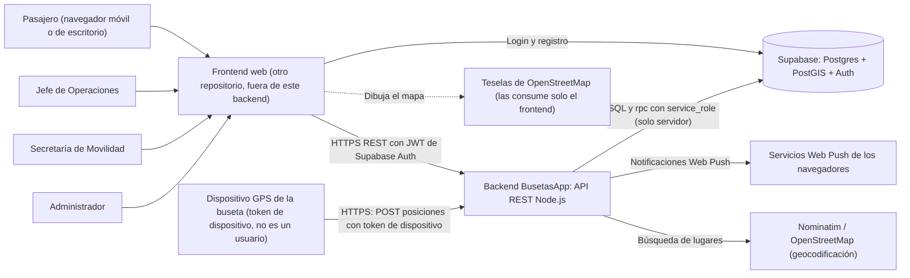
```mermaid
flowchart LR
    pasajero["Pasajero (navegador móvil o de escritorio)"]
    jefe["Jefe de Operaciones"]
    secretaria["Secretaría de Movilidad"]
    admin["Administrador"]
    dispositivo["Dispositivo GPS de la buseta (token de dispositivo, no es un usuario)"]
    front["Frontend web (otro repositorio, fuera de este backend)"]
    api["Backend BusetasApp: API REST Node.js"]
    supa[("Supabase: Postgres + PostGIS + Auth")]
    push["Servicios Web Push de los navegadores"]
    nomi["Nominatim / OpenStreetMap (geocodificación)"]
    tiles["Teselas de OpenStreetMap (las consume solo el frontend)"]

    pasajero --> front
    jefe --> front
    secretaria --> front
    admin --> front
    front -->|"HTTPS REST con JWT de Supabase Auth"| api
    front -->|"Login y registro"| supa
    front -.->|"Dibuja el mapa"| tiles
    dispositivo -->|"HTTPS: POST posiciones con token de dispositivo"| api
    api -->|"SQL y rpc con service_role (solo servidor)"| supa
    api -->|"Notificaciones Web Push"| push
    api -->|"Búsqueda de lugares"| nomi
```

### 6.2 Componentes y puertos (vista hexagonal)

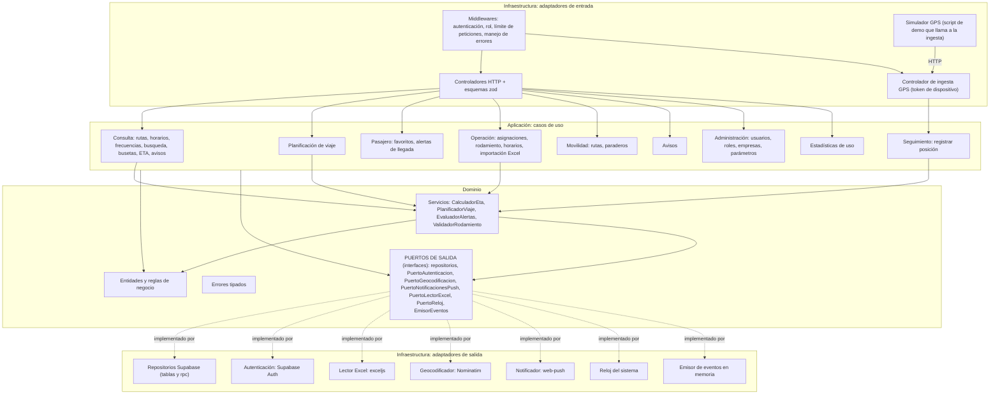
```mermaid
flowchart TB
    subgraph ENTRADA["Infraestructura: adaptadores de entrada"]
        mw["Middlewares: autenticación, rol, límite de peticiones, manejo de errores"]
        ctrl["Controladores HTTP + esquemas zod"]
        ingesta["Controlador de ingesta GPS (token de dispositivo)"]
        sim["Simulador GPS (script de demo que llama a la ingesta)"]
    end

    subgraph APP["Aplicación: casos de uso"]
        ucConsulta["Consulta: rutas, horarios, frecuencias, busqueda, busetas, ETA, avisos"]
        ucPlan["Planificación de viaje"]
        ucPasajero["Pasajero: favoritos, alertas de llegada"]
        ucSeguimiento["Seguimiento: registrar posición"]
        ucOperacion["Operación: asignaciones, rodamiento, horarios, importación Excel"]
        ucMovilidad["Movilidad: rutas, paraderos"]
        ucAvisos["Avisos"]
        ucAdmin["Administración: usuarios, roles, empresas, parámetros"]
        ucEstadisticas["Estadísticas de uso"]
    end

    subgraph DOM["Dominio"]
        ent["Entidades y reglas de negocio"]
        svc["Servicios: CalculadorEta, PlanificadorViaje, EvaluadorAlertas, ValidadorRodamiento"]
        errs["Errores tipados"]
        puertos["PUERTOS DE SALIDA (interfaces): repositorios, PuertoAutenticacion, PuertoGeocodificacion, PuertoNotificacionesPush, PuertoLectorExcel, PuertoReloj, EmisorEventos"]
    end

    subgraph SALIDA["Infraestructura: adaptadores de salida"]
        repo["Repositorios Supabase (tablas y rpc)"]
        aut["Autenticación: Supabase Auth"]
        xls["Lector Excel: exceljs"]
        geo["Geocodificador: Nominatim"]
        pushad["Notificador: web-push"]
        reloj["Reloj del sistema"]
        bus["Emisor de eventos en memoria"]
    end

    mw --> ctrl
    mw --> ingesta
    sim -->|"HTTP"| ingesta
    ctrl --> ucConsulta
    ctrl --> ucPlan
    ctrl --> ucPasajero
    ctrl --> ucOperacion
    ctrl --> ucMovilidad
    ctrl --> ucAvisos
    ctrl --> ucAdmin
    ctrl --> ucEstadisticas
    ingesta --> ucSeguimiento

    ucConsulta --> svc
    ucPlan --> svc
    ucSeguimiento --> svc
    ucOperacion --> svc
    APP --> ent
    APP --> puertos
    svc --> ent
    svc --> puertos

    puertos -.->|"implementado por"| repo
    puertos -.->|"implementado por"| aut
    puertos -.->|"implementado por"| xls
    puertos -.->|"implementado por"| geo
    puertos -.->|"implementado por"| pushad
    puertos -.->|"implementado por"| reloj
    puertos -.->|"implementado por"| bus
```

### 6.3 Despliegue del prototipo

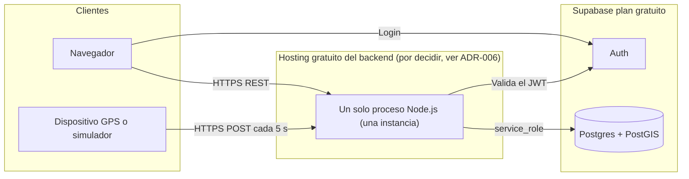
```mermaid
flowchart LR
    subgraph CLI["Clientes"]
        nav["Navegador"]
        disp["Dispositivo GPS o simulador"]
    end
    subgraph HOST["Hosting gratuito del backend (por decidir, ver ADR-006)"]
        nodo["Un solo proceso Node.js (una instancia)"]
    end
    subgraph SUPA["Supabase plan gratuito"]
        auth2["Auth"]
        pg[("Postgres + PostGIS")]
    end
    nav -->|"HTTPS REST"| nodo
    disp -->|"HTTPS POST cada 5 s"| nodo
    nav -->|"Login"| auth2
    nodo -->|"service_role"| pg
    nodo -->|"Valida el JWT"| auth2
```

---

## 7. Estructura de carpetas y reglas de dependencia

```text
backend/
  package.json
  .env.example
  supabase/
    migraciones/
      0001_extensiones_y_tipos.sql
      0002_tablas.sql
      0003_funciones_espaciales.sql
      0004_seguridad_rls.sql
    semillas/
      0001_parametros_y_permisos.sql
      0002_datos_demo_manizales.sql      # coordenadas a validar por el equipo
  src/
    app.js                               # construye la app Express (sin escuchar puerto)
    servidor.js                          # arranca el servidor
    composicion.js                       # ÚNICO lugar que crea adaptadores y los inyecta
    dominio/
      entidades/                         # ruta, parada, buseta, asignacion, aviso, etc.
      servicios/
        calculador-eta.js
        planificador-viaje.js
        evaluador-alertas.js
        validador-rodamiento.js
      puertos/
        repositorios/                    # un archivo por repositorio (sección 10)
        servicios-externos/              # autenticacion, geocodificacion, notificaciones-push, lector-excel, reloj, emisor-eventos
      errores.js
    aplicacion/
      casos-de-uso/
        consulta/
        planificacion/
        pasajero/
        seguimiento/
        operacion/
        movilidad/
        avisos/
        administracion/
        estadisticas/
      dtos/
    infraestructura/
      entrada/
        http/
          controladores/
          rutas/
          esquemas/                      # zod
          middlewares/
        simulador-gps/
      salida/
        supabase/                        # cliente.js y repositorio-*.js
        excel/
        geocodificacion/
        notificaciones-push/
        reloj/
        eventos/
      configuracion/
        variables-entorno.js
  pruebas/
    unitarias/                           # dominio y casos de uso, con repositorios en memoria
    integracion/                         # API + base de datos de prueba
```

**Reglas de dependencia (verificables con una prueba o regla de lint):**

```text
dominio          -> (nada)
aplicacion       -> dominio
infraestructura  -> aplicacion, dominio
composicion.js   -> todo
```

---

## 8. Modelo de datos

### 8.1 Diagrama entidad-relación


```mermaid
erDiagram
    EMPRESA ||--o{ PERFIL : "emplea a jefes"
    EMPRESA ||--o{ RUTA : "opera"
    EMPRESA ||--o{ BUSETA : "posee"
    EMPRESA ||--o{ CONDUCTOR : "contrata"
    EMPRESA ||--o{ RODAMIENTO : "planifica"
    EMPRESA ||--o{ AVISO : "publica"
    RUTA ||--o{ RUTA_PARADA : "pasa por"
    PARADA ||--o{ RUTA_PARADA : "es atendida en"
    RUTA ||--o{ HORARIO : "tiene"
    RUTA ||--o{ FRECUENCIA : "tiene"
    RUTA ||--o{ ASIGNACION : "recibe"
    BUSETA ||--o{ ASIGNACION : "cumple"
    CONDUCTOR ||--o{ ASIGNACION : "cumple"
    BUSETA ||--o| POSICION_BUSETA : "ultima posicion"
    RODAMIENTO ||--o{ TURNO_RODAMIENTO : "contiene"
    RUTA ||--o{ TURNO_RODAMIENTO : "se cubre en"
    BUSETA ||--o{ TURNO_RODAMIENTO : "cubre"
    CONDUCTOR ||--o{ TURNO_RODAMIENTO : "cubre"
    PERFIL ||--o{ FAVORITO : "guarda"
    RUTA ||--o{ FAVORITO : "es favorita"
    PARADA ||--o{ FAVORITO : "es favorita"
    PERFIL ||--o{ ALERTA_LLEGADA : "configura"
    PARADA ||--o{ ALERTA_LLEGADA : "vigila"
    RUTA ||--o{ ALERTA_LLEGADA : "vigila"
    PERFIL ||--o{ SUSCRIPCION_PUSH : "registra"
    PERFIL ||--o{ NOTIFICACION : "recibe"
    PERFIL ||--o{ AVISO : "redacta"
    AVISO ||--o{ AVISO_AFECTACION : "afecta"
    RUTA ||--o{ AVISO_AFECTACION : "afectada"
    PARADA ||--o{ AVISO_AFECTACION : "afectada"
    PERFIL ||--o{ IMPORTACION_EXCEL : "realiza"
    ROL_PERMISO }o--|| PERMISO : "otorga"
    HITO ||--o{ EVENTO_USO : "referencia opcional"
    RUTA ||--o{ EVENTO_USO : "genera"

    EMPRESA {
        uuid id PK
        text razon_social
        boolean activa
        int version
    }
    PERFIL {
        uuid id PK
        text correo
        enum rol
        uuid empresa_id FK
        boolean activo
        int version
    }
    PERMISO {
        text codigo PK
        text descripcion
    }
    ROL_PERMISO {
        enum rol PK
        text permiso_codigo PK
    }
    PARAMETRO_GLOBAL {
        text clave PK
        jsonb valor
        text descripcion
        int version
    }
    RUTA {
        uuid id PK
        uuid empresa_id FK
        text numero
        text nombre
        text codigo_empresa
        geography trazado
        boolean activa
        int version
    }
    PARADA {
        uuid id PK
        text nombre
        geography ubicacion
        boolean activa
        int version
    }
    RUTA_PARADA {
        uuid ruta_id PK
        uuid parada_id PK
        enum sentido PK
        int orden
        float distancia_desde_inicio_m
    }
    HITO {
        uuid id PK
        text nombre
        enum tipo
        geography ubicacion
        text_array alias
    }
    HORARIO {
        uuid id PK
        uuid ruta_id FK
        enum tipo_dia
        time hora_inicio
        time hora_fin
        int version
    }
    FRECUENCIA {
        uuid id PK
        uuid ruta_id FK
        enum tipo_dia
        time franja_inicio
        time franja_fin
        int minutos_min
        int minutos_max
        int version
    }
    BUSETA {
        uuid id PK
        uuid empresa_id FK
        text placa
        text token_dispositivo_hash
        boolean activa
        int version
    }
    CONDUCTOR {
        uuid id PK
        uuid empresa_id FK
        text nombre
        boolean activo
    }
    ASIGNACION {
        uuid id PK
        uuid ruta_id FK
        uuid buseta_id FK
        uuid conductor_id FK
        date vigente_desde
        date vigente_hasta
        int version
    }
    POSICION_BUSETA {
        uuid buseta_id PK
        uuid ruta_id FK
        geography ubicacion
        real velocidad_kmh
        real rumbo
        timestamptz reportada_en
    }
    RODAMIENTO {
        uuid id PK
        uuid empresa_id FK
        date fecha
        enum estado
        int version
    }
    TURNO_RODAMIENTO {
        uuid id PK
        uuid rodamiento_id FK
        uuid ruta_id FK
        uuid buseta_id FK
        uuid conductor_id FK
        time hora_salida
        time hora_fin
    }
    FAVORITO {
        uuid id PK
        uuid usuario_id FK
        enum tipo
        uuid ruta_id FK
        uuid parada_id FK
    }
    ALERTA_LLEGADA {
        uuid id PK
        uuid usuario_id FK
        uuid ruta_id FK
        uuid parada_id FK
        int distancia_aviso_m
        boolean activa
        timestamptz ultima_notificacion_en
    }
    SUSCRIPCION_PUSH {
        uuid id PK
        uuid usuario_id FK
        text endpoint
        jsonb claves
    }
    NOTIFICACION {
        uuid id PK
        uuid usuario_id FK
        text mensaje
        enum estado
        timestamptz creada_en
    }
    AVISO {
        uuid id PK
        enum origen
        enum tipo
        uuid empresa_id FK
        uuid publicado_por FK
        text titulo
        text cuerpo
        timestamptz vigente_desde
        timestamptz vigente_hasta
        boolean activo
    }
    AVISO_AFECTACION {
        uuid aviso_id PK
        uuid ruta_id FK
        uuid parada_id FK
    }
    EVENTO_USO {
        uuid id PK
        enum tipo
        uuid ruta_id FK
        uuid empresa_id FK
        timestamptz creado_en
    }
    IMPORTACION_EXCEL {
        uuid id PK
        uuid usuario_id FK
        enum tipo
        text archivo_nombre
        int filas_total
        int filas_ok
        jsonb filas_error
        timestamptz creada_en
    }
```

Notas del modelo:
- `PERFIL.id` es el mismo UUID que `auth.users.id` de Supabase Auth. No se guarda contraseña en tablas propias.
- `CONDUCTOR` **no tiene usuario** (BR-06): solo es un dato del rodamiento. No guardar documento de identidad ni otros datos sensibles: basta nombre.
- `PARAMETRO_GLOBAL` no se relaciona con otras tablas (por eso no tiene líneas en el diagrama).
- Las rutas por hito **no se materializan**: se calculan por cercanía espacial entre `RUTA.trazado` y `HITO.ubicacion` (función `rutas_por_hito`).

### 8.2 Esquema SQL (migraciones 0001 y 0002)

```sql
-- 0001_extensiones_y_tipos.sql
create extension if not exists postgis;
create extension if not exists pg_trgm;
create extension if not exists unaccent;

create type rol_usuario        as enum ('pasajero','jefe_operaciones','secretaria_movilidad','administrador');
create type tipo_dia           as enum ('lun_vie','sabado','dom_festivo');
create type sentido_ruta       as enum ('ida','vuelta','unico');
create type tipo_hito          as enum ('barrio','sector','universidad','hospital','terminal','hito_urbano');
create type origen_aviso       as enum ('empresa','movilidad','aplicativo');
create type tipo_aviso         as enum ('general','cambio_movilidad','mantenimiento');
create type estado_rodamiento  as enum ('borrador','publicado');
create type tipo_favorito      as enum ('ruta','parada');
create type estado_notificacion as enum ('enviada','fallida');
create type tipo_importacion   as enum ('rutas_paradas','conductores_busetas','rodamiento');
create type tipo_evento_uso    as enum ('vista_mapa','consulta_ruta','consulta_horario','consulta_eta','busqueda','planificacion');
```

```sql
-- 0002_tablas.sql
-- Convención: "version" arranca en 1 y la incrementa el repositorio en cada UPDATE (sección 13.2).

create table empresa (
  id uuid primary key default gen_random_uuid(),
  razon_social text not null unique,
  activa boolean not null default true,
  version integer not null default 1,
  creada_en timestamptz not null default now()
);

create table perfil (
  id uuid primary key references auth.users(id) on delete cascade,
  correo text not null,
  rol rol_usuario not null default 'pasajero',
  empresa_id uuid references empresa(id),
  activo boolean not null default true,
  version integer not null default 1,
  creado_en timestamptz not null default now(),
  constraint jefe_requiere_empresa check (rol <> 'jefe_operaciones' or empresa_id is not null)
);

create table permiso (
  codigo text primary key,
  descripcion text not null
);

create table rol_permiso (
  rol rol_usuario not null,
  permiso_codigo text not null references permiso(codigo),
  primary key (rol, permiso_codigo)
);

create table parametro_global (
  clave text primary key,
  valor jsonb not null,
  descripcion text not null,
  actualizado_por uuid references perfil(id),
  version integer not null default 1
);

create table ruta (
  id uuid primary key default gen_random_uuid(),
  empresa_id uuid not null references empresa(id),
  numero text not null,
  nombre text not null,
  codigo_empresa text,                       -- cada empresa identifica sus rutas distinto
  trazado geography(LineString,4326) not null,
  activa boolean not null default true,
  version integer not null default 1,
  creada_en timestamptz not null default now(),
  unique (empresa_id, numero)
);
create index ruta_trazado_gix on ruta using gist (trazado);
create index ruta_nombre_trgm on ruta using gin (lower(nombre) gin_trgm_ops);

create table parada (
  id uuid primary key default gen_random_uuid(),
  nombre text not null,
  ubicacion geography(Point,4326) not null,
  activa boolean not null default true,
  version integer not null default 1
);
create index parada_ubicacion_gix on parada using gist (ubicacion);

create table ruta_parada (
  ruta_id uuid not null references ruta(id) on delete cascade,
  parada_id uuid not null references parada(id),
  sentido sentido_ruta not null default 'unico',
  orden integer not null check (orden >= 1),
  distancia_desde_inicio_m double precision not null check (distancia_desde_inicio_m >= 0),
  primary key (ruta_id, parada_id, sentido),
  unique (ruta_id, sentido, orden)
);

create table hito (
  id uuid primary key default gen_random_uuid(),
  nombre text not null,
  tipo tipo_hito not null,
  ubicacion geography(Point,4326) not null,
  alias text[] not null default '{}'
);
create index hito_ubicacion_gix on hito using gist (ubicacion);
create index hito_nombre_trgm on hito using gin (lower(nombre) gin_trgm_ops);

create table horario (
  id uuid primary key default gen_random_uuid(),
  ruta_id uuid not null references ruta(id) on delete cascade,
  tipo_dia tipo_dia not null,
  hora_inicio time not null,
  hora_fin time not null,
  version integer not null default 1,
  unique (ruta_id, tipo_dia)
);

create table frecuencia (
  id uuid primary key default gen_random_uuid(),
  ruta_id uuid not null references ruta(id) on delete cascade,
  tipo_dia tipo_dia not null,
  franja_inicio time not null,
  franja_fin time not null,
  minutos_min integer not null check (minutos_min > 0),
  minutos_max integer not null check (minutos_max >= minutos_min),   -- rango cuando la frecuencia es variable
  version integer not null default 1,
  check (franja_fin > franja_inicio)
);

create table buseta (
  id uuid primary key default gen_random_uuid(),
  empresa_id uuid not null references empresa(id),
  placa text not null unique,
  token_dispositivo_hash text unique,         -- hash del token, nunca el token en claro
  activa boolean not null default true,
  version integer not null default 1
);

create table conductor (
  id uuid primary key default gen_random_uuid(),
  empresa_id uuid not null references empresa(id),
  nombre text not null,
  activo boolean not null default true
);

create table asignacion (
  id uuid primary key default gen_random_uuid(),
  ruta_id uuid not null references ruta(id),
  buseta_id uuid not null references buseta(id),
  conductor_id uuid references conductor(id),
  vigente_desde date not null default current_date,
  vigente_hasta date,
  version integer not null default 1
);
create unique index asignacion_buseta_vigente_ux on asignacion (buseta_id) where vigente_hasta is null;
create unique index asignacion_conductor_vigente_ux on asignacion (conductor_id) where vigente_hasta is null and conductor_id is not null;

create table posicion_buseta (               -- una fila por buseta: SOLO la última posición
  buseta_id uuid primary key references buseta(id) on delete cascade,
  ruta_id uuid references ruta(id),
  ubicacion geography(Point,4326) not null,
  velocidad_kmh real,
  rumbo real,
  reportada_en timestamptz not null,
  recibida_en timestamptz not null default now()
);
create index posicion_ruta_ix on posicion_buseta (ruta_id);

create table rodamiento (
  id uuid primary key default gen_random_uuid(),
  empresa_id uuid not null references empresa(id),
  fecha date not null,
  estado estado_rodamiento not null default 'borrador',
  publicado_por uuid references perfil(id),
  version integer not null default 1,
  unique (empresa_id, fecha)
);

create table turno_rodamiento (
  id uuid primary key default gen_random_uuid(),
  rodamiento_id uuid not null references rodamiento(id) on delete cascade,
  ruta_id uuid not null references ruta(id),
  buseta_id uuid not null references buseta(id),
  conductor_id uuid not null references conductor(id),
  hora_salida time not null,
  hora_fin time not null,
  check (hora_fin > hora_salida)
);

create table favorito (
  id uuid primary key default gen_random_uuid(),
  usuario_id uuid not null references perfil(id) on delete cascade,
  tipo tipo_favorito not null,
  ruta_id uuid references ruta(id) on delete cascade,
  parada_id uuid references parada(id) on delete cascade,
  creado_en timestamptz not null default now(),
  check ((tipo = 'ruta' and ruta_id is not null and parada_id is null)
      or (tipo = 'parada' and parada_id is not null and ruta_id is null))
);
create unique index favorito_unico_ux on favorito (usuario_id, coalesce(ruta_id, '00000000-0000-0000-0000-000000000000'), coalesce(parada_id, '00000000-0000-0000-0000-000000000000'));

create table suscripcion_push (
  id uuid primary key default gen_random_uuid(),
  usuario_id uuid not null references perfil(id) on delete cascade,
  endpoint text not null unique,
  claves jsonb not null,
  creada_en timestamptz not null default now()
);

create table alerta_llegada (
  id uuid primary key default gen_random_uuid(),
  usuario_id uuid not null references perfil(id) on delete cascade,
  ruta_id uuid not null references ruta(id) on delete cascade,
  parada_id uuid not null references parada(id) on delete cascade,
  distancia_aviso_m integer not null check (distancia_aviso_m > 0),
  activa boolean not null default true,
  ultima_notificacion_en timestamptz,
  unique (usuario_id, ruta_id, parada_id)
);

create table notificacion (
  id uuid primary key default gen_random_uuid(),
  usuario_id uuid not null references perfil(id) on delete cascade,
  mensaje text not null,
  estado estado_notificacion not null,
  creada_en timestamptz not null default now()
);

create table aviso (
  id uuid primary key default gen_random_uuid(),
  origen origen_aviso not null,
  tipo tipo_aviso not null default 'general',
  empresa_id uuid references empresa(id),     -- obligatorio solo si origen = 'empresa'
  publicado_por uuid not null references perfil(id),
  titulo text not null,
  cuerpo text not null,
  vigente_desde timestamptz not null default now(),
  vigente_hasta timestamptz,
  activo boolean not null default true,
  constraint aviso_empresa_coherente check ((origen = 'empresa') = (empresa_id is not null))
);

create table aviso_afectacion (
  aviso_id uuid not null references aviso(id) on delete cascade,
  ruta_id uuid references ruta(id),
  parada_id uuid references parada(id),
  check (ruta_id is not null or parada_id is not null)
);

create table evento_uso (                    -- anónimo: sin usuario, sin IP, sin dispositivo
  id uuid primary key default gen_random_uuid(),
  tipo tipo_evento_uso not null,
  ruta_id uuid references ruta(id),
  empresa_id uuid references empresa(id),
  creado_en timestamptz not null default now()
);
create index evento_uso_fecha_ix on evento_uso (empresa_id, creado_en);

create table importacion_excel (
  id uuid primary key default gen_random_uuid(),
  usuario_id uuid not null references perfil(id),
  tipo tipo_importacion not null,
  archivo_nombre text not null,
  filas_total integer not null,
  filas_ok integer not null,
  filas_error jsonb not null default '[]',    -- [{fila, columna, motivo}]
  creada_en timestamptz not null default now()
);
```

### 8.3 Funciones SQL (migración 0003)

`supabase-js` no ofrece operaciones PostGIS directas: **toda consulta espacial o transaccional se hace con estas funciones vía `rpc`**. Los agentes no deben reescribir esta lógica en JavaScript.

```sql
-- 0003_funciones_espaciales.sql

-- HU-P01: rutas cuyo trazado pasa a menos de p_radio_m del punto
create or replace function rutas_cercanas(p_lat double precision, p_lng double precision, p_radio_m integer)
returns table (ruta_id uuid, numero text, nombre text, empresa_id uuid, distancia_m double precision)
language sql stable as $$
  with punto as (select st_setsrid(st_makepoint(p_lng, p_lat), 4326)::geography as g)
  select r.id, r.numero, r.nombre, r.empresa_id, st_distance(r.trazado, punto.g)
  from ruta r, punto
  where r.activa and st_dwithin(r.trazado, punto.g, p_radio_m)
  order by 5;
$$;

-- HU-P01 alt., HU-P07: paradas cercanas (opcionalmente solo de una ruta).
-- Para "el paradero más cercano a la ruta que desea tomar" usar p_radio_m = 50000 y p_limite = 1.
create or replace function paradas_cercanas(
  p_lat double precision, p_lng double precision, p_radio_m integer,
  p_ruta_id uuid default null, p_limite integer default 10)
returns table (parada_id uuid, nombre text, distancia_m double precision)
language sql stable as $$
  with punto as (select st_setsrid(st_makepoint(p_lng, p_lat), 4326)::geography as g)
  select p.id, p.nombre, st_distance(p.ubicacion, punto.g)
  from parada p, punto
  where p.activa
    and st_dwithin(p.ubicacion, punto.g, p_radio_m)
    and (p_ruta_id is null or exists (
          select 1 from ruta_parada rp where rp.parada_id = p.id and rp.ruta_id = p_ruta_id))
  order by 3
  limit p_limite;
$$;

-- HU-P09: rutas que pasan a menos de p_radio_m de un hito
create or replace function rutas_por_hito(p_hito_id uuid, p_radio_m integer default 300)
returns table (ruta_id uuid, numero text, nombre text, empresa_id uuid)
language sql stable as $$
  select r.id, r.numero, r.nombre, r.empresa_id
  from ruta r join hito h on h.id = p_hito_id
  where r.activa and st_dwithin(r.trazado, h.ubicacion, p_radio_m);
$$;

-- HU-P06: avance de un punto a lo largo del trazado y su desvío respecto al trazado
create or replace function progreso_en_ruta(p_ruta_id uuid, p_lat double precision, p_lng double precision)
returns table (progreso_m double precision, desvio_m double precision)
language sql stable as $$
  select st_linelocatepoint(r.trazado::geometry, st_setsrid(st_makepoint(p_lng, p_lat), 4326))
           * st_length(r.trazado),
         st_distance(r.trazado, st_setsrid(st_makepoint(p_lng, p_lat), 4326)::geography)
  from ruta r where r.id = p_ruta_id;
$$;

-- HU-P05: guarda solo la última posición; descarta una posición más antigua que la guardada.
-- Devuelve true si la posición fue aceptada.
create or replace function guardar_posicion(
  p_buseta_id uuid, p_ruta_id uuid, p_lat double precision, p_lng double precision,
  p_velocidad_kmh real, p_rumbo real, p_reportada_en timestamptz)
returns boolean language plpgsql as $$
declare v_filas integer;
begin
  insert into posicion_buseta (buseta_id, ruta_id, ubicacion, velocidad_kmh, rumbo, reportada_en)
  values (p_buseta_id, p_ruta_id, st_setsrid(st_makepoint(p_lng, p_lat), 4326)::geography,
          p_velocidad_kmh, p_rumbo, p_reportada_en)
  on conflict (buseta_id) do update
    set ruta_id = excluded.ruta_id, ubicacion = excluded.ubicacion,
        velocidad_kmh = excluded.velocidad_kmh, rumbo = excluded.rumbo,
        reportada_en = excluded.reportada_en, recibida_en = now()
    where posicion_buseta.reportada_en < excluded.reportada_en;
  get diagnostics v_filas = row_count;
  return v_filas > 0;
end $$;

-- HU-J01: cierra la asignación vigente de la buseta y crea la nueva en UNA transacción
create or replace function reasignar_buseta(p_buseta_id uuid, p_ruta_id uuid, p_conductor_id uuid)
returns uuid language plpgsql as $$
declare v_id uuid;
begin
  update asignacion set vigente_hasta = current_date, version = version + 1
   where buseta_id = p_buseta_id and vigente_hasta is null;
  insert into asignacion (ruta_id, buseta_id, conductor_id)
  values (p_ruta_id, p_buseta_id, p_conductor_id)
  returning id into v_id;
  return v_id;
end $$;
```

Además, los agentes deben implementar en esta migración (con la misma convención) las funciones de **escritura multi-paso**: `eliminar_ruta_con_asignaciones(p_ruta_id, p_version)` (baja lógica de la ruta y cierre de sus asignaciones vigentes, D-04) y `reemplazar_paradas_de_ruta(p_ruta_id, p_paradas jsonb)` (reescribe `ruta_parada` y recalcula `distancia_desde_inicio_m` con `st_linelocatepoint`).

### 8.4 Seguridad a nivel de base de datos (migración 0004)

- `alter table ... enable row level security` en **todas** las tablas, **sin políticas** para `anon` ni `authenticated`: solo el backend, con `service_role`, accede a los datos. La clave `service_role` **nunca** sale del servidor ni va al frontend.
- La autorización real vive en los casos de uso y middlewares (sección 13.1). El RLS es una red de seguridad (defensa en profundidad).
- Si más adelante el frontend usa Supabase Realtime sobre `posicion_buseta`, se agrega una política `select` de solo lectura para esa tabla. No es parte del prototipo (ADR-004).

### 8.5 Parámetros globales iniciales (semilla 0001)

> **Valores iniciales propuestos**, editables por el administrador (HU-A04). Los agentes **leen siempre estos valores desde `parametro_global`**, no los escriben en el código.

| Clave | Valor inicial | Uso |
|---|---|---|
| `radio_busqueda_m` | 800 | Radio por defecto de `rutas_cercanas` |
| `radio_caminata_m` | 500 | Distancia máxima a pie hasta una parada (planificación) |
| `radio_transbordo_m` | 200 | Distancia máxima entre paradas de un transbordo |
| `radio_hito_m` | 300 | Cercanía ruta–hito |
| `velocidad_default_kmh` | 20 | Velocidad para ETA cuando no hay dato fiable |
| `umbral_posicion_obsoleta_s` | 60 | Una posición más vieja se considera sin señal GPS |
| `distancia_aviso_llegada_m` | 300 | Distancia de aviso por defecto en alertas |
| `enfriamiento_alerta_min` | 10 | Mínimo entre dos avisos de la misma alerta |
| `umbral_desvio_m` | 100 | Distancia al trazado que se considera desvío |
| `longitud_max_aviso` | 500 | Caracteres máximos de un aviso (HU-J05 alt.) |
| `max_opciones_viaje` | 3 | Opciones devueltas por la planificación |
| `max_filas_excel` | 5000 | Límite por archivo |
| `tamano_max_excel_mb` | 5 | Límite por archivo |

---

## 9. Contrato de la API REST

### 9.1 Convenciones

- Prefijo `/api/v1`. JSON UTF-8. Fechas en ISO 8601 con zona. Coordenadas como `lat` y `lng` (grados decimales, WGS84). Geometrías como **GeoJSON** (`[lng, lat]`).
- Autenticación: `Authorization: Bearer <JWT de Supabase Auth>`. El endpoint de ingesta usa `X-Token-Dispositivo`. Los endpoints marcados "Público" no requieren cuenta (BR-01).
- Las actualizaciones (`PUT`) **deben incluir `version`** en el cuerpo (sección 13.2).
- Paginación (`limite`, `desplazamiento`) en listados administrativos. Por defecto 50, máximo 200.
- Cada respuesta del servidor incluye `X-Id-Peticion` (UUID) para rastrear sin datos personales.

### 9.2 Matriz de roles

| Rol | Puede |
|---|---|
| (sin cuenta) | Todo lo marcado **Público** |
| `pasajero` | Público + favoritos y alertas de llegada |
| `jefe_operaciones` | Público + operación de **su empresa** (asignaciones, horarios, frecuencias, rodamiento, Excel de conductores/rodamiento, avisos de empresa, estadísticas) |
| `secretaria_movilidad` | Público + rutas, paraderos, Excel de rutas y paradas, cambios de movilidad |
| `administrador` | Superconjunto de gestión (D-05) + usuarios, roles, empresas, parámetros, avisos del aplicativo |
| dispositivo de buseta | Solo `POST /ingesta/posiciones` |

### 9.3 Errores

Formato único: `{ "error": { "codigo": "…", "mensaje": "…", "detalles": … } }`.

| Código | HTTP | Cuándo |
|---|---|---|
| `VALIDACION` | 400 | Falla de `zod` o regla de formato |
| `NO_AUTENTICADO` | 401 | Sin token o token inválido |
| `NO_AUTORIZADO` | 403 | Rol o empresa no permitidos |
| `NO_ENCONTRADO` | 404 | El recurso no existe o está dado de baja |
| `CONFLICTO_VERSION` | 409 | La `version` enviada no coincide (detalles: versión actual) |
| `CONFLICTO_NEGOCIO` | 409 | Regla de negocio (duplicado, asignaciones activas, solapamientos) |
| `SERVICIO_EXTERNO_NO_DISPONIBLE` | 503 | Supabase, geocodificador o push no responden. El cliente debe ofrecer reintentar |
| `ERROR_INTERNO` | 500 | Cualquier otro (sin filtrar detalles internos) |

En `dominio/errores.js` existe una clase por código, con el mismo nombre en `PascalCase` (`ErrorValidacion`, `ErrorNoAutenticado`, …).

### 9.4 Endpoints públicos (sin cuenta)

| ID | Método y ruta | Entrada | Salida | Caso de uso | HU |
|---|---|---|---|---|---|
| E-01 | `GET /rutas` | `lat`, `lng`, `radio_m?` | `{rutas:[{id,numero,nombre,empresaId,distanciaM}], paradas:[…]}` | `consultarRutasCercanas` | P01 |
| E-02 | `GET /rutas/:rutaId` | — | Ruta con `trazado` (GeoJSON) y `paradas` ordenadas por sentido. 404 si no existe: el cliente llama a E-01 con las coordenadas del destino | `obtenerDetalleRuta` | P02 |
| E-03 | `GET /rutas/:rutaId/horarios` | — | `[{tipoDia,horaInicio,horaFin}]`. Si no hay datos: `{horarios:[],estado:"pendiente_actualizacion"}` | `consultarHorarios` | P03 |
| E-04 | `GET /rutas/:rutaId/frecuencias` | — | `[{tipoDia,franjaInicio,franjaFin,minutosMin,minutosMax}]`. Si `min≠max` es un rango | `consultarFrecuencias` | P04 |
| E-05 | `GET /rutas/:rutaId/busetas` | — | `{busetas:[{busetaId,placa,lat,lng,velocidadKmh,reportadaEn,estado:"activa"\|"sin_senal"}], unidadesEnServicio:n}` | `consultarBusetasEnVivo` | P05 |
| E-06 | `GET /paradas/:paradaId/eta` | `ruta_id` | `{fuente:"gps"\|"horario"\|"no_disponible", etaSegundos?, rango?, busetaId?, mensaje?, calculadoEn}` | `calcularEtaParada` | P06 |
| E-07 | `GET /paradas/cercanas` | `lat`, `lng`, `radio_m?`, `ruta_id?`, `limite?` | `[{paradaId,nombre,distanciaM}]` | `consultarParadasCercanas` | P01 alt. |
| E-08 | `POST /viajes/planificar` | `{origen:{lat,lng}\|{hitoId}\|{texto}, destino: igual}` | `{opciones:[{tipo:"directa"\|"con_transbordo", tramos:[…], tiempoTotalMin}]}` (máx. 3) | `planificarViaje` | P07 |
| E-09 | `GET /busqueda/rutas` | `q` (número o nombre) | `[{id,numero,nombre,empresaId}]` o `[]` | `buscarRutasPorTexto` | P08 |
| E-10 | `GET /busqueda/hitos` | `q`, `tipo?` | `[{id,nombre,tipo,lat,lng}]` | `buscarHitos` | P09 |
| E-11 | `GET /hitos/:hitoId/rutas` | — | `{rutas:[…]}`. Si vacío: `{rutas:[], paradaMasCercana:{…}}` (SPEC-005) | `consultarRutasPorHito` | P09 |
| E-12 | `GET /avisos` | `empresa_id?`, `ruta_id?` | Avisos vigentes (de empresa, de movilidad y del aplicativo) | `consultarAvisosVigentes` | J05, SM05, A05 |
| E-13 | `GET /salud` | — | `{estado:"ok"}` | — | — |

Las consultas E-01 a E-11 registran un `evento_uso` (sin datos personales) de forma **no bloqueante**.

### 9.5 Endpoints de pasajero autenticado

| ID | Método y ruta | Entrada | Salida | Caso de uso | HU |
|---|---|---|---|---|---|
| E-20 | `GET /favoritos` | — | Lista de favoritos del usuario | `listarFavoritos` | P10 |
| E-21 | `POST /favoritos` | `{tipo:"ruta"\|"parada", rutaId?, paradaId?}` | 201 + favorito. Duplicado: 409 `CONFLICTO_NEGOCIO` | `agregarFavorito` | P10 |
| E-22 | `DELETE /favoritos/:favoritoId` | — | 204 | `quitarFavorito` | P10 |
| E-23 | `POST /alertas-llegada` | `{rutaId, paradaId, distanciaAvisoM?}` | 201 + alerta | `crearAlertaLlegada` | P11 |
| E-24 | `GET /alertas-llegada` | — | Alertas del usuario | `listarAlertasLlegada` | P11 |
| E-25 | `DELETE /alertas-llegada/:alertaId` | — | 204 | `eliminarAlertaLlegada` | P11 |
| E-26 | `POST /suscripciones-push` | `{endpoint, claves:{p256dh,auth}}` | 201 | `registrarSuscripcionPush` | P11 |

Sin sesión, estos endpoints devuelven 401 con `mensaje` "Inicia sesión para guardar" (HU-P10 y P12 alternativos).

### 9.6 Ingesta de posiciones

| ID | Método y ruta | Entrada | Salida | Caso de uso | HU |
|---|---|---|---|---|---|
| E-30 | `POST /ingesta/posiciones` | Cabecera `X-Token-Dispositivo`. Cuerpo `{lat,lng,velocidadKmh?,rumbo?,reportadaEn}` | 202 `{aceptada:boolean}` | `registrarPosicion` | P05 (origen), P11 |

Validación: `lat` ∈ [-90, 90], `lng` ∈ [-180, 180], `reportadaEn` no más de 60 s en el futuro. Límite de tasa por token (un reporte cada 2 s). El `busetaId` y la `rutaId` **se deducen del token y de la asignación vigente**, no vienen en el cuerpo.

### 9.7 Jefe de Operaciones (solo su empresa)

| ID | Método y ruta | Entrada | Salida | Caso de uso | HU |
|---|---|---|---|---|---|
| E-40 | `GET /conductores`, `GET /busetas` | filtros | Listas de la empresa | `listarConductores`, `listarBusetas` | J01 |
| E-41 | `GET /asignaciones` | — | Asignaciones vigentes | `listarAsignaciones` | J01 |
| E-42 | `POST /asignaciones` | `{rutaId, busetaId, conductorId, confirmarCambio?}` | 201. Si la buseta ya tiene asignación y falta `confirmarCambio`: 409 con la asignación actual | `asignarRecursos` | J01 |
| E-43 | `PUT /rutas/:rutaId/horarios` | `{horarios:[…], version}` | 200 | `actualizarHorariosRuta` | J02 |
| E-44 | `PUT /rutas/:rutaId/frecuencias` | `{frecuencias:[…], version}` | 200 | `actualizarFrecuenciasRuta` | J02 |
| E-45 | `POST /importaciones/excel` | `multipart`: `tipo`, `archivo` (.xlsx) | `{filasTotal, filasOk, filasError:[{fila,columna,motivo}]}` | `importarDesdeExcel` | J03 |
| E-46 | `POST /busetas/:busetaId/token-dispositivo` | — | `{token}` **se muestra una sola vez** (se guarda su hash) | `generarTokenDispositivo` | D-01 |
| E-47 | `POST /rodamientos` | `{fecha, turnos:[{rutaId,busetaId,conductorId,horaSalida,horaFin}]}` | 201 + `advertencias` (D-14) | `crearRodamiento` | J04 |
| E-48 | `PUT /rodamientos/:id` | igual + `version` | 200 + `advertencias` | `actualizarRodamiento` | J04 |
| E-49 | `POST /rodamientos/:id/publicar` | `{version}` | 200. Con solapamientos: 409 con la lista | `publicarRodamiento` | J04 |
| E-50 | `GET /estadisticas/uso` | `desde`, `hasta` | `{totalesPorTipo, porRuta:[…], porDia:[…]}`. Sin datos: `{sinDatos:true}` | `consultarEstadisticasUso` | J06 |

### 9.8 Secretaría de Movilidad

| ID | Método y ruta | Entrada | Salida | Caso de uso | HU |
|---|---|---|---|---|---|
| E-60 | `POST /rutas` | `{empresaId, numero, nombre, codigoEmpresa?, trazado, paradas:[{paradaId,sentido,orden}]}` | 201. Ruta ya asignada a otra empresa: 409 `CONFLICTO_NEGOCIO` | `registrarRuta` | SM01 |
| E-61 | `PUT /rutas/:rutaId` | datos + `version` | 200. 404 si no existe | `editarRuta` | SM02 |
| E-62 | `DELETE /rutas/:rutaId` | `confirmar?` | 204. Con asignaciones vigentes y sin `confirmar=true`: 409 con las asignaciones | `eliminarRuta` | SM03 |
| E-63 | `POST /paradas` | `{nombre, lat, lng}` | 201. Duplicado (mismo nombre a menos de 20 m): 409 | `crearParada` | SM04 |
| E-64 | `PUT /paradas/:paradaId` | datos + `version` | 200 | `editarParada` | SM04 |
| E-65 | `DELETE /paradas/:paradaId` | — | 204 (baja lógica) | `eliminarParada` | SM04 |
| E-66 | `POST /importaciones/excel` | `tipo=rutas_paradas` | igual a E-45 | `importarDesdeExcel` | SM01, SM04 |
| E-67 | `GET /empresas` | — | Empresas activas (para asignar rutas) | `listarEmpresas` | SM01 |
| E-49b | `POST /avisos` | `{tipo:"cambio_movilidad", titulo, cuerpo, vigenteHasta?, afecta:[{rutaId?,paradaId?}]}` | 201. Datos incompletos: 400 | `publicarAviso` | SM05 |

### 9.9 Jefe, Secretaría y Administrador: publicación de avisos

| ID | Método y ruta | Entrada | Salida | Caso de uso | HU |
|---|---|---|---|---|---|
| E-51 | `POST /avisos` | `{tipo, titulo, cuerpo, vigenteHasta?, afecta?}` | 201. El `origen` se deduce del rol (D-13): jefe da `empresa`, secretaría da `movilidad`, admin da `aplicativo`. Aviso vacío: 400. Más largo que `longitud_max_aviso`: **400 con el límite** (HU-J05 alt.: "el sistema limita la longitud") | `publicarAviso` | J05, SM05, A05 |
| E-52 | `DELETE /avisos/:avisoId` | — | 204 (desactiva) | `retirarAviso` | J05, SM05, A05 |

### 9.10 Administrador

| ID | Método y ruta | Entrada | Salida | Caso de uso | HU |
|---|---|---|---|---|---|
| E-70 | `GET /admin/usuarios`, `POST /admin/usuarios`, `PUT /admin/usuarios/:id` | `{correo, rol, empresaId?, activo?, version}` | Usuario. No encontrado: 404 | `gestionarUsuarios` | A01 |
| E-71 | `GET /admin/roles`, `PUT /admin/roles/:rol/permisos` | `{permisos:[codigo], version?}` | Rol válido solo entre los 4 del enum, si no 400 | `gestionarRolesPermisos` | A02 |
| E-72 | `GET/POST /admin/empresas`, `PUT /admin/empresas/:id` | `{razonSocial, activa?, version}` | Empresa. No encontrada: 404 | `gestionarEmpresas` | A03 |
| E-73 | `GET /admin/parametros`, `PUT /admin/parametros/:clave` | `{valor, version}` | Parámetro. Clave o valor inválido: 400 | `configurarParametro` | A04 |

---

## 10. Puertos del dominio (firmas)

> Definidos como objetos con métodos asíncronos en `dominio/puertos/`. Los adaptadores los implementan **exactamente** con estos nombres. Todos los métodos de escritura reciben `version` y lanzan `ErrorConflictoVersion` si no coincide.

**Repositorios**

```text
RepositorioRutas
  buscarCercanas({ lat, lng, radioMetros })          -> Ruta[]
  obtenerPorId(rutaId)                               -> Ruta | null    (con trazado y paradas)
  buscarPorTexto(texto)                              -> Ruta[]
  buscarPorHito(hitoId, radioMetros)                 -> Ruta[]
  crear(datosRuta)                                   -> Ruta
  actualizar(rutaId, datos, versionEsperada)         -> Ruta
  darDeBaja(rutaId, versionEsperada, cerrarAsignaciones) -> void
  contarAsignacionesVigentes(rutaId)                 -> number
  obtenerGrafoParaPlanificacion()                    -> { rutas, paradasPorRuta }   (para el cache en memoria)

RepositorioParadas
  buscarCercanas({ lat, lng, radioMetros, rutaId?, limite }) -> ParadaCercana[]
  obtenerPorId(paradaId) | crear | actualizar(…, versionEsperada) | darDeBaja
  existeDuplicada({ nombre, lat, lng, radioMetros })           -> boolean

RepositorioHitos        buscarPorTexto(texto, tipo?) | obtenerPorId(hitoId)
RepositorioHorarios     obtenerPorRuta(rutaId) | reemplazarPorRuta(rutaId, horarios, versionEsperada)
RepositorioFrecuencias  obtenerPorRuta(rutaId) | reemplazarPorRuta(rutaId, frecuencias, versionEsperada)

RepositorioBusetas
  buscarPorTokenDispositivo(hashToken)               -> { buseta, rutaIdVigente } | null
  listarPorEmpresa(empresaId) | guardarHashToken(busetaId, hash)

RepositorioPosiciones
  guardarUltimaPosicion({ busetaId, rutaId, lat, lng, velocidadKmh, rumbo, reportadaEn }) -> boolean (aceptada)
  listarPorRuta(rutaId)                              -> PosicionBuseta[]
  calcularProgreso(rutaId, lat, lng)                 -> { progresoMetros, desvioMetros }

RepositorioConductores    listarPorEmpresa(empresaId) | upsertarVarios(empresaId, conductores)
RepositorioAsignaciones   listarVigentesPorEmpresa(empresaId) | buscarVigentePorBuseta(busetaId) | reasignar({ busetaId, rutaId, conductorId })
RepositorioRodamientos    crear | actualizar(…, versionEsperada) | publicar(id, versionEsperada, usuarioId) | obtenerPorId
RepositorioFavoritos      listarPorUsuario | agregar | quitar | existe
RepositorioAlertas        crear | listarPorUsuario | eliminar | listarActivasPorRuta(rutaId) | marcarNotificada(alertaId, instante)
RepositorioSuscripcionesPush  guardar | listarPorUsuario | eliminarPorEndpoint
RepositorioNotificaciones     registrar({ usuarioId, mensaje, estado })
RepositorioAvisos         crear | listarVigentes({ empresaId?, rutaId? }) | desactivar
RepositorioUsuarios       obtenerPerfil(usuarioId) | listar | crear | actualizar(…, versionEsperada)
RepositorioRolesPermisos  listar | reemplazarPermisos(rol, permisos)
RepositorioEmpresas       listar | obtener | crear | actualizar(…, versionEsperada)
RepositorioParametros     obtenerTodos() | actualizar(clave, valor, versionEsperada)
RepositorioEventosUso     registrar({ tipo, rutaId?, empresaId? }) | resumir({ empresaId, desde, hasta })
RepositorioImportaciones  registrar(resultado)
```

**Servicios externos**

```text
PuertoAutenticacion        verificarToken(tokenJwt)  -> { usuarioId, rol, empresaId } | lanza ErrorNoAutenticado
PuertoGeocodificacion      buscarLugar(texto)        -> { lat, lng, nombre } | null     (lanza ErrorServicioExterno)
PuertoNotificacionesPush   enviar(suscripcion, { titulo, cuerpo }) -> void              (lanza ErrorServicioExterno)
PuertoLectorExcel          leerFilas(buffer, tipoImportacion) -> { filas:[…], errores:[{fila,columna,motivo}] }
PuertoReloj                ahora() -> Date          (para pruebas deterministas)
EmisorEventos              emitir(nombreEvento, carga) | suscribir(nombreEvento, manejador)
```

---

## 11. Servicios de dominio: algoritmos

### 11.1 `CalculadorEta` (HU-P06, D-09)

Entrada: `parada`, `ruta`, `sentido`. Todos los umbrales se leen de `parametro_global`.

1. Obtener las posiciones de la ruta (`RepositorioPosiciones.listarPorRuta`) y descartar las que superan `umbral_posicion_obsoleta_s`.
2. Para cada buseta vigente: `progresoMetros = calcularProgreso(...)`. `distanciaRestanteM = ruta_parada.distancia_desde_inicio_m − progresoMetros`.
3. Si `distanciaRestanteM < 0`, la buseta **ya pasó** la parada y se ignora (no se modelan rutas circulares, D-07).
4. `velocidad = velocidadKmh` reportada si es mayor que 5 km/h; si no, `velocidad_default_kmh`. `etaSegundos = distanciaRestanteM / (velocidad / 3.6)`.
5. Resultado = la buseta con menor ETA, `fuente: "gps"`.
6. **Sin ninguna buseta válida** (sin señal, ninguna activa o todas ya pasaron): respaldo `fuente: "horario"`, con el rango `{minutosMin, minutosMax}` de la `frecuencia` vigente según día y hora, y `mensaje: "Ubicación no disponible. Esté pendiente de la siguiente buseta"`. Si tampoco hay frecuencia: `fuente: "no_disponible"`.
7. Si el cálculo falla por error inesperado: `ERROR_INTERNO` y el cliente ofrece reintentar (HU-P06 excepción).

### 11.2 `PlanificadorViaje` (HU-P07, D-08)

Opera sobre un **grafo en memoria** (`obtenerGrafoParaPlanificacion`), con cache de 60 s que se invalida al escribir rutas o paradas.

1. Resolver origen y destino a coordenadas: `{lat,lng}` directo, `{hitoId}` desde la tabla `hito`, o `{texto}` primero contra `hito` y, si no hay coincidencia, con `PuertoGeocodificacion`. Si el geocodificador falla: 503.
2. `paradasOrigen` y `paradasDestino` = paradas dentro de `radio_caminata_m` (máx. 10 cada una, ordenadas por distancia).
3. **Directas:** rutas con una parada de `paradasOrigen` y una de `paradasDestino` en el mismo sentido, con `orden` origen < `orden` destino.
4. **Con un transbordo** (solo si no hay directas): ruta A que sale de `paradasOrigen` y ruta B que llega a `paradasDestino`, con una parada de A y una de B a ≤ `radio_transbordo_m` entre sí.
5. Tiempo total = caminata (`distancia / 1.2 m/s`) + espera (`frecuenciaMax / 2`) + viaje (`diferencia de distancia_desde_inicio_m / velocidad_default`). Devolver hasta `max_opciones_viaje` opciones ordenadas por tiempo.
6. Sin ninguna opción: `{opciones: []}` y mensaje "Sin rutas para ese viaje".

### 11.3 `EvaluadorAlertas` (HU-P11, D-12)

Se ejecuta después de aceptar cada posición, **sin bloquear la respuesta** (los errores se capturan y se registran, no se propagan).

1. Cargar las alertas activas de la ruta de la buseta.
2. Para cada alerta: `distanciaRestante = distancia_desde_inicio_m de la parada − progresoMetros`. Si `0 ≤ distanciaRestante ≤ distancia_aviso_m` y `ahora − ultima_notificacion_en > enfriamiento_alerta_min` (o es la primera vez): enviar push a las suscripciones del usuario, registrar la `notificacion` y marcar `ultima_notificacion_en`.
3. **Desvío** (HU-P11 alt.): si `desvioMetros > umbral_desvio_m`, enviar a las alertas de esa ruta un aviso de "cambio de estado: la buseta se desvió" (con el mismo enfriamiento).
4. Si el push falla (`ErrorServicioExterno`): registrar `notificacion` con estado `fallida`. No reintentar en el prototipo.

### 11.4 `ValidadorRodamiento` (HU-J04, D-14)

Dos turnos **se solapan** si comparten `busetaId` o `conductorId` y sus intervalos `[horaSalida, horaFin)` se intersectan. Devuelve la lista de pares en conflicto. Además valida que cada ruta, buseta y conductor pertenezca a la empresa del jefe.

---

## 12. Diagramas de secuencia

> Convención de participantes: **Controlador HTTP** (valida con zod y traduce errores), **caso de uso**, **Repositorio** y **Supabase**. Todos los repositorios hablan con Supabase; para abreviar se omite en algunos pasos.

### S1. Rutas cercanas en el mapa (HU-P01)

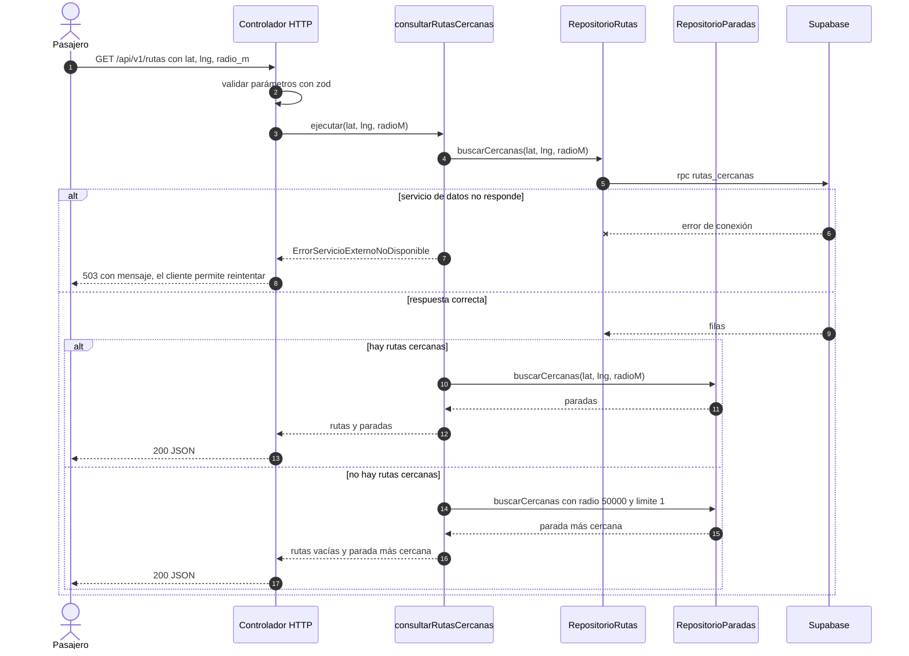
```mermaid
sequenceDiagram
    autonumber
    actor P as Pasajero
    participant API as Controlador HTTP
    participant CU as consultarRutasCercanas
    participant RR as RepositorioRutas
    participant RP as RepositorioParadas
    participant DB as Supabase

    P->>API: GET /api/v1/rutas con lat, lng, radio_m
    API->>API: validar parámetros con zod
    API->>CU: ejecutar(lat, lng, radioM)
    CU->>RR: buscarCercanas(lat, lng, radioM)
    RR->>DB: rpc rutas_cercanas
    alt servicio de datos no responde
        DB--xRR: error de conexión
        CU-->>API: ErrorServicioExternoNoDisponible
        API-->>P: 503 con mensaje, el cliente permite reintentar
    else respuesta correcta
        DB-->>RR: filas
        alt hay rutas cercanas
            CU->>RP: buscarCercanas(lat, lng, radioM)
            RP-->>CU: paradas
            CU-->>API: rutas y paradas
            API-->>P: 200 JSON
        else no hay rutas cercanas
            CU->>RP: buscarCercanas con radio 50000 y limite 1
            RP-->>CU: parada más cercana
            CU-->>API: rutas vacías y parada más cercana
            API-->>P: 200 JSON
        end
    end
```

### S2. Detalle de ruta, horarios y frecuencia (HU-P02, P03, P04)

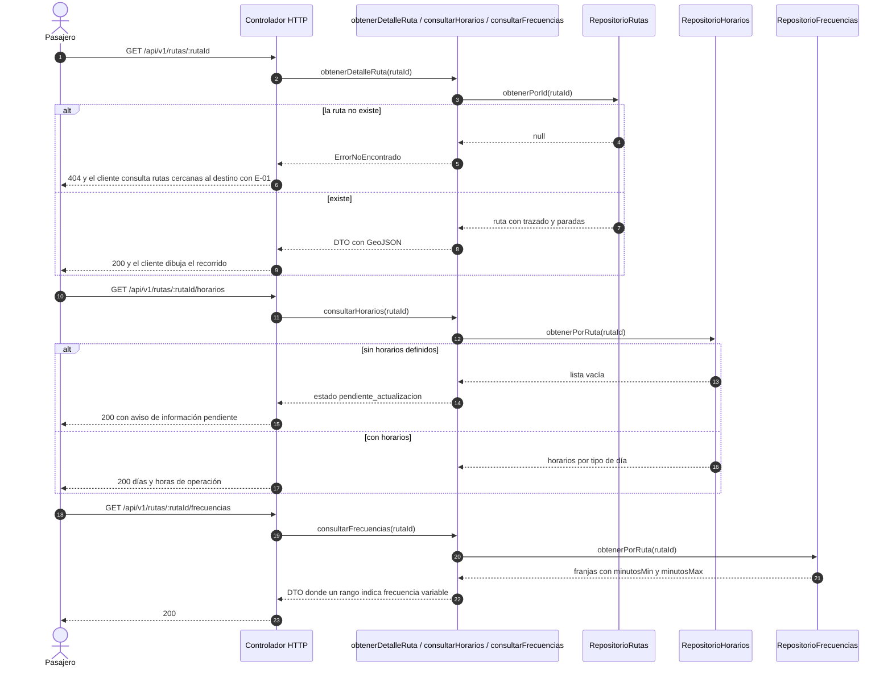
```mermaid
sequenceDiagram
    autonumber
    actor P as Pasajero
    participant API as Controlador HTTP
    participant CU as obtenerDetalleRuta / consultarHorarios / consultarFrecuencias
    participant RR as RepositorioRutas
    participant RH as RepositorioHorarios
    participant RF as RepositorioFrecuencias

    P->>API: GET /api/v1/rutas/:rutaId
    API->>CU: obtenerDetalleRuta(rutaId)
    CU->>RR: obtenerPorId(rutaId)
    alt la ruta no existe
        RR-->>CU: null
        CU-->>API: ErrorNoEncontrado
        API-->>P: 404 y el cliente consulta rutas cercanas al destino con E-01
    else existe
        RR-->>CU: ruta con trazado y paradas
        CU-->>API: DTO con GeoJSON
        API-->>P: 200 y el cliente dibuja el recorrido
    end

    P->>API: GET /api/v1/rutas/:rutaId/horarios
    API->>CU: consultarHorarios(rutaId)
    CU->>RH: obtenerPorRuta(rutaId)
    alt sin horarios definidos
        RH-->>CU: lista vacía
        CU-->>API: estado pendiente_actualizacion
        API-->>P: 200 con aviso de información pendiente
    else con horarios
        RH-->>CU: horarios por tipo de día
        API-->>P: 200 días y horas de operación
    end

    P->>API: GET /api/v1/rutas/:rutaId/frecuencias
    API->>CU: consultarFrecuencias(rutaId)
    CU->>RF: obtenerPorRuta(rutaId)
    RF-->>CU: franjas con minutosMin y minutosMax
    CU-->>API: DTO donde un rango indica frecuencia variable
    API-->>P: 200
```

### S3. Búsqueda por número, nombre o hito (HU-P08, P09)

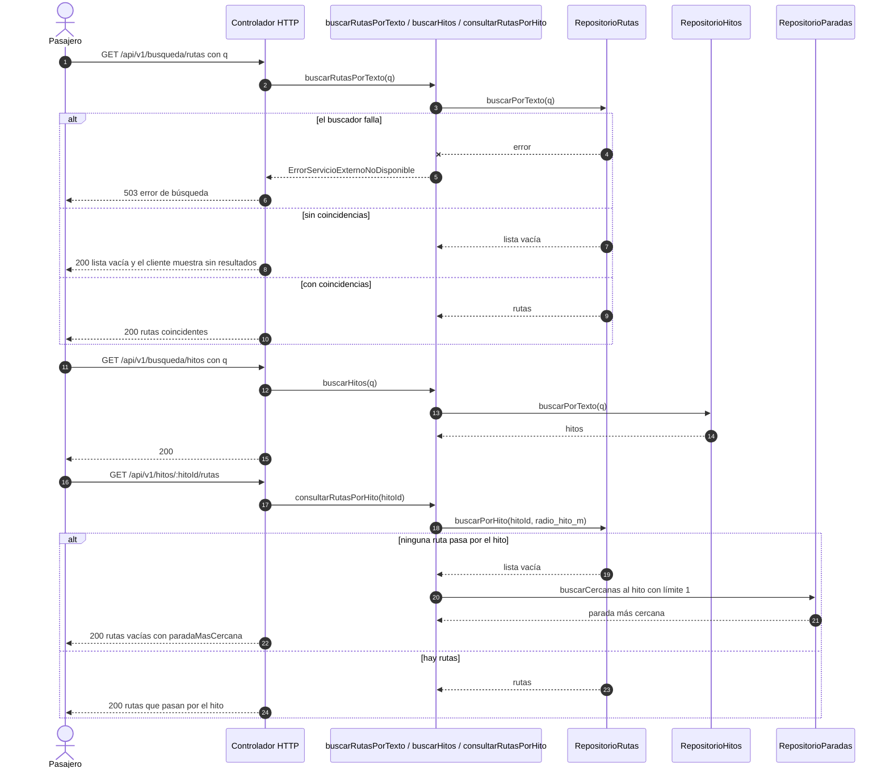
```mermaid
sequenceDiagram
    autonumber
    actor P as Pasajero
    participant API as Controlador HTTP
    participant CU as buscarRutasPorTexto / buscarHitos / consultarRutasPorHito
    participant RR as RepositorioRutas
    participant RH as RepositorioHitos
    participant RP as RepositorioParadas

    P->>API: GET /api/v1/busqueda/rutas con q
    API->>CU: buscarRutasPorTexto(q)
    CU->>RR: buscarPorTexto(q)
    alt el buscador falla
        RR--xCU: error
        CU-->>API: ErrorServicioExternoNoDisponible
        API-->>P: 503 error de búsqueda
    else sin coincidencias
        RR-->>CU: lista vacía
        API-->>P: 200 lista vacía y el cliente muestra sin resultados
    else con coincidencias
        RR-->>CU: rutas
        API-->>P: 200 rutas coincidentes
    end

    P->>API: GET /api/v1/busqueda/hitos con q
    API->>CU: buscarHitos(q)
    CU->>RH: buscarPorTexto(q)
    RH-->>CU: hitos
    API-->>P: 200

    P->>API: GET /api/v1/hitos/:hitoId/rutas
    API->>CU: consultarRutasPorHito(hitoId)
    CU->>RR: buscarPorHito(hitoId, radio_hito_m)
    alt ninguna ruta pasa por el hito
        RR-->>CU: lista vacía
        CU->>RP: buscarCercanas al hito con límite 1
        RP-->>CU: parada más cercana
        API-->>P: 200 rutas vacías con paradaMasCercana
    else hay rutas
        RR-->>CU: rutas
        API-->>P: 200 rutas que pasan por el hito
    end
```

### S4. Ingesta de posición GPS y evaluación de alertas (HU-P05 origen de datos, HU-P11)

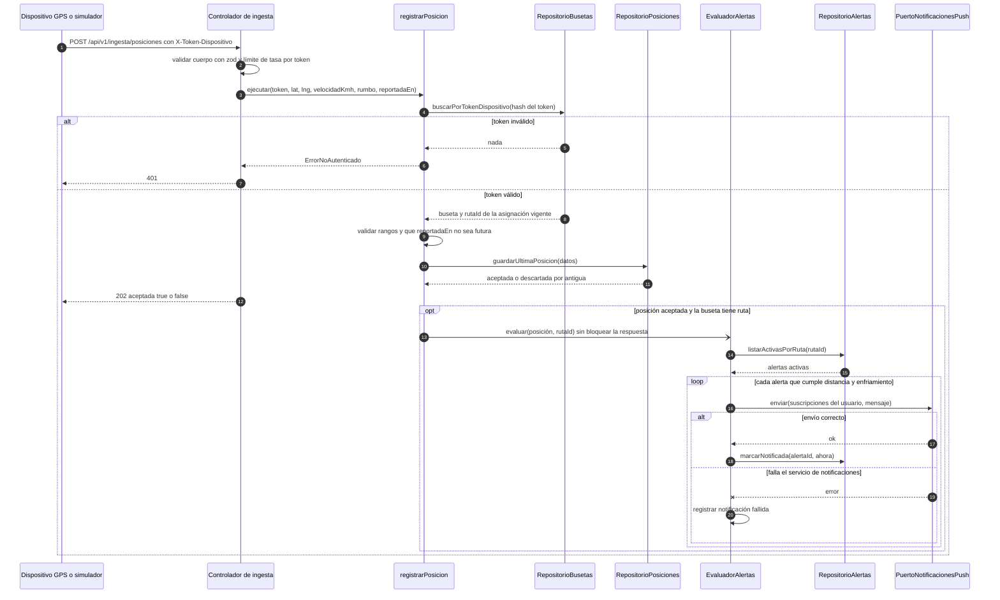
```mermaid
sequenceDiagram
    autonumber
    participant D as Dispositivo GPS o simulador
    participant API as Controlador de ingesta
    participant CU as registrarPosicion
    participant RB as RepositorioBusetas
    participant RP as RepositorioPosiciones
    participant EV as EvaluadorAlertas
    participant RA as RepositorioAlertas
    participant PN as PuertoNotificacionesPush

    D->>API: POST /api/v1/ingesta/posiciones con X-Token-Dispositivo
    API->>API: validar cuerpo con zod y límite de tasa por token
    API->>CU: ejecutar(token, lat, lng, velocidadKmh, rumbo, reportadaEn)
    CU->>RB: buscarPorTokenDispositivo(hash del token)
    alt token inválido
        RB-->>CU: nada
        CU-->>API: ErrorNoAutenticado
        API-->>D: 401
    else token válido
        RB-->>CU: buseta y rutaId de la asignación vigente
        CU->>CU: validar rangos y que reportadaEn no sea futura
        CU->>RP: guardarUltimaPosicion(datos)
        RP-->>CU: aceptada o descartada por antigua
        API-->>D: 202 aceptada true o false
        opt posición aceptada y la buseta tiene ruta
            CU-)EV: evaluar(posición, rutaId) sin bloquear la respuesta
            EV->>RA: listarActivasPorRuta(rutaId)
            RA-->>EV: alertas activas
            loop cada alerta que cumple distancia y enfriamiento
                EV->>PN: enviar(suscripciones del usuario, mensaje)
                alt envío correcto
                    PN-->>EV: ok
                    EV->>RA: marcarNotificada(alertaId, ahora)
                else falla el servicio de notificaciones
                    PN--xEV: error
                    EV->>EV: registrar notificación fallida
                end
            end
        end
    end
```

### S5. Busetas en vivo y ETA (HU-P05, P06)

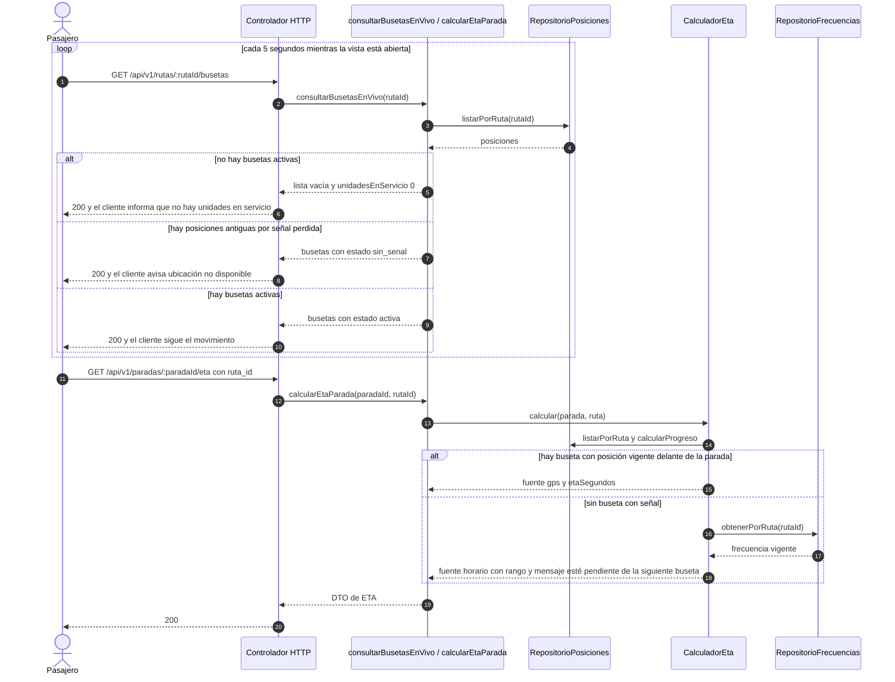
```mermaid
sequenceDiagram
    autonumber
    actor P as Pasajero
    participant API as Controlador HTTP
    participant CU as consultarBusetasEnVivo / calcularEtaParada
    participant RP as RepositorioPosiciones
    participant CE as CalculadorEta
    participant RF as RepositorioFrecuencias

    loop cada 5 segundos mientras la vista está abierta
        P->>API: GET /api/v1/rutas/:rutaId/busetas
        API->>CU: consultarBusetasEnVivo(rutaId)
        CU->>RP: listarPorRuta(rutaId)
        RP-->>CU: posiciones
        alt no hay busetas activas
            CU-->>API: lista vacía y unidadesEnServicio 0
            API-->>P: 200 y el cliente informa que no hay unidades en servicio
        else hay posiciones antiguas por señal perdida
            CU-->>API: busetas con estado sin_senal
            API-->>P: 200 y el cliente avisa ubicación no disponible
        else hay busetas activas
            CU-->>API: busetas con estado activa
            API-->>P: 200 y el cliente sigue el movimiento
        end
    end

    P->>API: GET /api/v1/paradas/:paradaId/eta con ruta_id
    API->>CU: calcularEtaParada(paradaId, rutaId)
    CU->>CE: calcular(parada, ruta)
    CE->>RP: listarPorRuta y calcularProgreso
    alt hay buseta con posición vigente delante de la parada
        CE-->>CU: fuente gps y etaSegundos
    else sin buseta con señal
        CE->>RF: obtenerPorRuta(rutaId)
        RF-->>CE: frecuencia vigente
        CE-->>CU: fuente horario con rango y mensaje esté pendiente de la siguiente buseta
    end
    CU-->>API: DTO de ETA
    API-->>P: 200
```

### S6. Planificar un viaje (HU-P07)

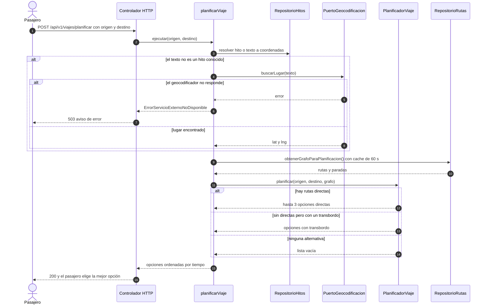
```mermaid
sequenceDiagram
    autonumber
    actor P as Pasajero
    participant API as Controlador HTTP
    participant CU as planificarViaje
    participant RH as RepositorioHitos
    participant GE as PuertoGeocodificacion
    participant PV as PlanificadorViaje
    participant RR as RepositorioRutas

    P->>API: POST /api/v1/viajes/planificar con origen y destino
    API->>CU: ejecutar(origen, destino)
    CU->>RH: resolver hito o texto a coordenadas
    alt el texto no es un hito conocido
        CU->>GE: buscarLugar(texto)
        alt el geocodificador no responde
            GE--xCU: error
            CU-->>API: ErrorServicioExternoNoDisponible
            API-->>P: 503 aviso de error
        else lugar encontrado
            GE-->>CU: lat y lng
        end
    end
    CU->>RR: obtenerGrafoParaPlanificacion() con cache de 60 s
    RR-->>CU: rutas y paradas
    CU->>PV: planificar(origen, destino, grafo)
    alt hay rutas directas
        PV-->>CU: hasta 3 opciones directas
    else sin directas pero con un transbordo
        PV-->>CU: opciones con transbordo
    else ninguna alternativa
        PV-->>CU: lista vacía
    end
    CU-->>API: opciones ordenadas por tiempo
    API-->>P: 200 y el pasajero elige la mejor opción
```

### S7. Favoritos y uso sin cuenta (HU-P10, P12)

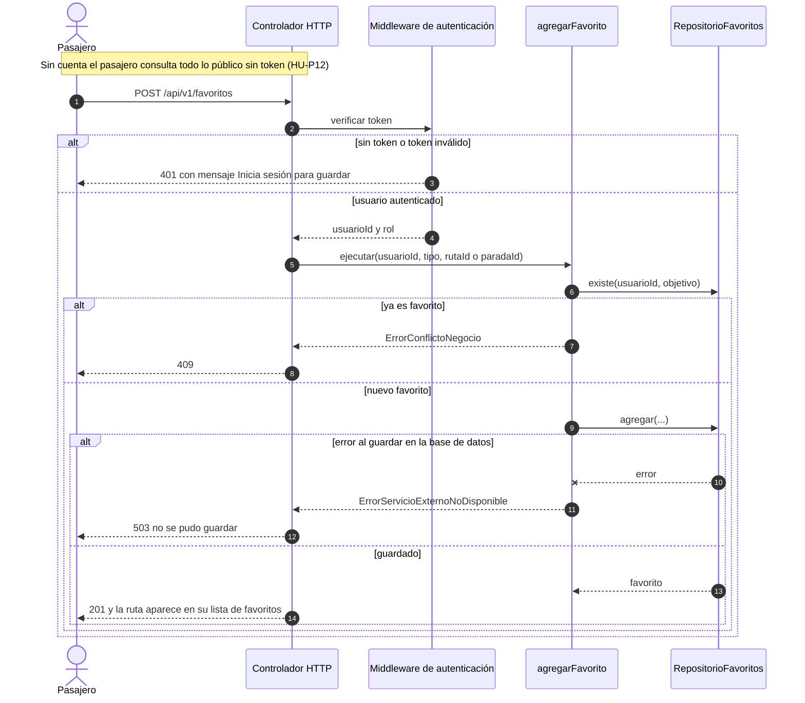
```mermaid
sequenceDiagram
    autonumber
    actor P as Pasajero
    participant API as Controlador HTTP
    participant AU as Middleware de autenticación
    participant CU as agregarFavorito
    participant RF as RepositorioFavoritos

    Note over P,API: Sin cuenta el pasajero consulta todo lo público sin token (HU-P12)
    P->>API: POST /api/v1/favoritos
    API->>AU: verificar token
    alt sin token o token inválido
        AU-->>P: 401 con mensaje Inicia sesión para guardar
    else usuario autenticado
        AU-->>API: usuarioId y rol
        API->>CU: ejecutar(usuarioId, tipo, rutaId o paradaId)
        CU->>RF: existe(usuarioId, objetivo)
        alt ya es favorito
            CU-->>API: ErrorConflictoNegocio
            API-->>P: 409
        else nuevo favorito
            CU->>RF: agregar(...)
            alt error al guardar en la base de datos
                RF--xCU: error
                CU-->>API: ErrorServicioExternoNoDisponible
                API-->>P: 503 no se pudo guardar
            else guardado
                RF-->>CU: favorito
                API-->>P: 201 y la ruta aparece en su lista de favoritos
            end
        end
    end
```

### S8. Alerta de llegada y suscripción push (HU-P11)

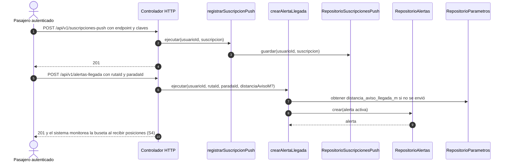
```mermaid
sequenceDiagram
    autonumber
    actor P as Pasajero autenticado
    participant API as Controlador HTTP
    participant CS as registrarSuscripcionPush
    participant CA as crearAlertaLlegada
    participant RS as RepositorioSuscripcionesPush
    participant RA as RepositorioAlertas
    participant RP as RepositorioParametros

    P->>API: POST /api/v1/suscripciones-push con endpoint y claves
    API->>CS: ejecutar(usuarioId, suscripcion)
    CS->>RS: guardar(usuarioId, suscripcion)
    API-->>P: 201

    P->>API: POST /api/v1/alertas-llegada con rutaId y paradaId
    API->>CA: ejecutar(usuarioId, rutaId, paradaId, distanciaAvisoM?)
    CA->>RP: obtener distancia_aviso_llegada_m si no se envió
    CA->>RA: crear(alerta activa)
    RA-->>CA: alerta
    API-->>P: 201 y el sistema monitorea la buseta al recibir posiciones (S4)
```

### S9. Autenticación y autorización (transversal)

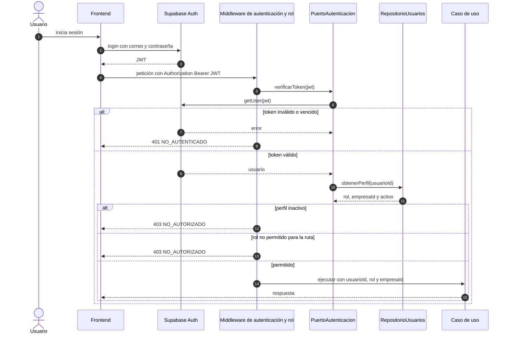
```mermaid
sequenceDiagram
    autonumber
    actor U as Usuario
    participant F as Frontend
    participant SA as Supabase Auth
    participant MW as Middleware de autenticación y rol
    participant PA as PuertoAutenticacion
    participant RU as RepositorioUsuarios
    participant CU as Caso de uso

    U->>F: inicia sesión
    F->>SA: login con correo y contraseña
    SA-->>F: JWT
    F->>MW: petición con Authorization Bearer JWT
    MW->>PA: verificarToken(jwt)
    PA->>SA: getUser(jwt)
    alt token inválido o vencido
        SA-->>PA: error
        MW-->>F: 401 NO_AUTENTICADO
    else token válido
        SA-->>PA: usuario
        PA->>RU: obtenerPerfil(usuarioId)
        RU-->>PA: rol, empresaId y activo
        alt perfil inactivo
            MW-->>F: 403 NO_AUTORIZADO
        else rol no permitido para la ruta
            MW-->>F: 403 NO_AUTORIZADO
        else permitido
            MW->>CU: ejecutar con usuarioId, rol y empresaId
            CU-->>F: respuesta
        end
    end
```

### S10. Importación desde Excel (HU-J03, carga de rutas por la Secretaría)

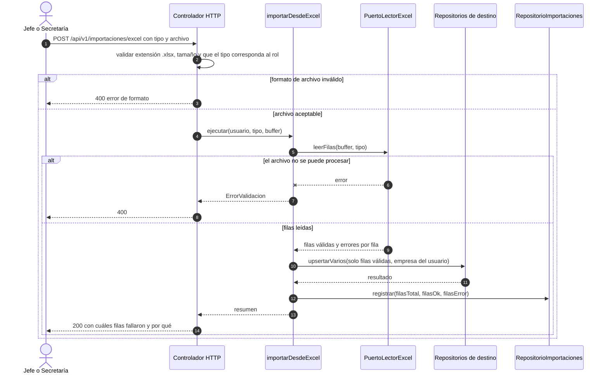
```mermaid
sequenceDiagram
    autonumber
    actor U as Jefe o Secretaría
    participant API as Controlador HTTP
    participant CU as importarDesdeExcel
    participant LE as PuertoLectorExcel
    participant RE as Repositorios de destino
    participant RI as RepositorioImportaciones

    U->>API: POST /api/v1/importaciones/excel con tipo y archivo
    API->>API: validar extensión .xlsx, tamaño y que el tipo corresponda al rol
    alt formato de archivo inválido
        API-->>U: 400 error de formato
    else archivo aceptable
        API->>CU: ejecutar(usuario, tipo, buffer)
        CU->>LE: leerFilas(buffer, tipo)
        alt el archivo no se puede procesar
            LE--xCU: error
            CU-->>API: ErrorValidacion
            API-->>U: 400
        else filas leídas
            LE-->>CU: filas válidas y errores por fila
            CU->>RE: upsertarVarios(solo filas válidas, empresa del usuario)
            RE-->>CU: resultado
            CU->>RI: registrar(filasTotal, filasOk, filasError)
            CU-->>API: resumen
            API-->>U: 200 con cuáles filas fallaron y por qué
        end
    end
```

### S11. Asignación de recursos y rodamiento (HU-J01, J04)

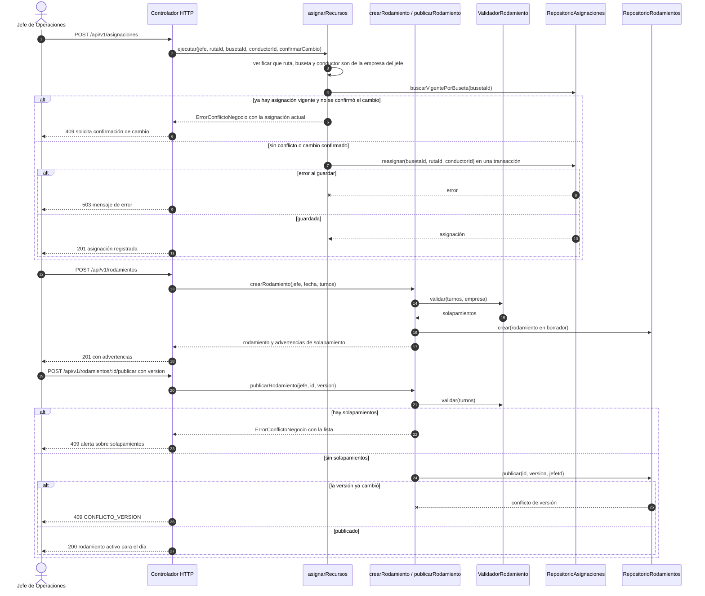
```mermaid
sequenceDiagram
    autonumber
    actor J as Jefe de Operaciones
    participant API as Controlador HTTP
    participant CA as asignarRecursos
    participant CR as crearRodamiento / publicarRodamiento
    participant VR as ValidadorRodamiento
    participant RA as RepositorioAsignaciones
    participant RR as RepositorioRodamientos

    J->>API: POST /api/v1/asignaciones
    API->>CA: ejecutar(jefe, rutaId, busetaId, conductorId, confirmarCambio)
    CA->>CA: verificar que ruta, buseta y conductor son de la empresa del jefe
    CA->>RA: buscarVigentePorBuseta(busetaId)
    alt ya hay asignación vigente y no se confirmó el cambio
        CA-->>API: ErrorConflictoNegocio con la asignación actual
        API-->>J: 409 solicita confirmación de cambio
    else sin conflicto o cambio confirmado
        CA->>RA: reasignar(busetaId, rutaId, conductorId) en una transacción
        alt error al guardar
            RA--xCA: error
            API-->>J: 503 mensaje de error
        else guardada
            RA-->>CA: asignación
            API-->>J: 201 asignación registrada
        end
    end

    J->>API: POST /api/v1/rodamientos
    API->>CR: crearRodamiento(jefe, fecha, turnos)
    CR->>VR: validar(turnos, empresa)
    VR-->>CR: solapamientos
    CR->>RR: crear(rodamiento en borrador)
    CR-->>API: rodamiento y advertencias de solapamiento
    API-->>J: 201 con advertencias

    J->>API: POST /api/v1/rodamientos/:id/publicar con version
    API->>CR: publicarRodamiento(jefe, id, version)
    CR->>VR: validar(turnos)
    alt hay solapamientos
        CR-->>API: ErrorConflictoNegocio con la lista
        API-->>J: 409 alerta sobre solapamientos
    else sin solapamientos
        CR->>RR: publicar(id, version, jefeId)
        alt la versión ya cambió
            RR--xCR: conflicto de versión
            API-->>J: 409 CONFLICTO_VERSION
        else publicado
            API-->>J: 200 rodamiento activo para el día
        end
    end
```

### S12. Escritura con control de versión y eliminación de ruta (HU-SM01 a SM04, J02)

> El mismo patrón aplica a editar paraderos (SM04), horarios y frecuencias (J02) y a toda la administración (A01 a A04).

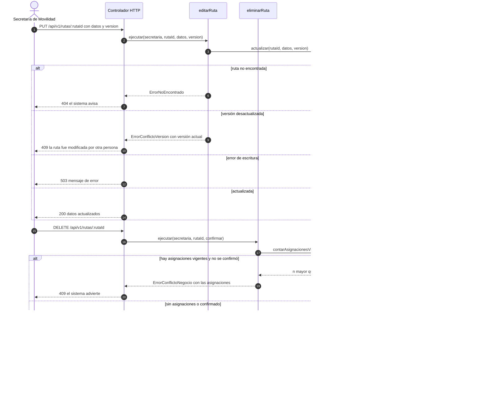
```mermaid
sequenceDiagram
    autonumber
    actor S as Secretaría de Movilidad
    participant API as Controlador HTTP
    participant CE as editarRuta
    participant CD as eliminarRuta
    participant RR as RepositorioRutas
    participant DB as Supabase

    S->>API: PUT /api/v1/rutas/:rutaId con datos y version
    API->>CE: ejecutar(secretaria, rutaId, datos, version)
    CE->>RR: actualizar(rutaId, datos, version)
    RR->>DB: update ... where id y version, version = version + 1
    alt ruta no encontrada
        DB-->>RR: 0 filas y no existe
        CE-->>API: ErrorNoEncontrado
        API-->>S: 404 el sistema avisa
    else versión desactualizada
        DB-->>RR: 0 filas y existe
        CE-->>API: ErrorConflictoVersion con versión actual
        API-->>S: 409 la ruta fue modificada por otra persona
    else error de escritura
        DB--xRR: error
        API-->>S: 503 mensaje de error
    else actualizada
        DB-->>RR: fila
        API-->>S: 200 datos actualizados
    end

    S->>API: DELETE /api/v1/rutas/:rutaId
    API->>CD: ejecutar(secretaria, rutaId, confirmar)
    CD->>RR: contarAsignacionesVigentes(rutaId)
    alt hay asignaciones vigentes y no se confirmó
        RR-->>CD: n mayor que 0
        CD-->>API: ErrorConflictoNegocio con las asignaciones
        API-->>S: 409 el sistema advierte
    else sin asignaciones o confirmado
        CD->>RR: darDeBaja(rutaId, version, cerrarAsignaciones)
        alt error al eliminar
            RR--xCD: error
            API-->>S: 503
        else dada de baja
            API-->>S: 204 y la ruta deja de aparecer en consultas
        end
    end
```

### S13. Publicación de avisos (HU-J05, SM05, A05)

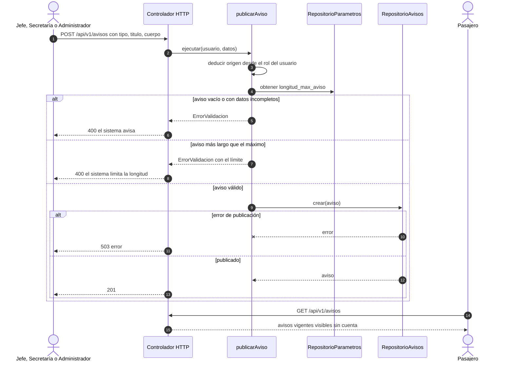
```mermaid
sequenceDiagram
    autonumber
    actor U as Jefe, Secretaría o Administrador
    participant API as Controlador HTTP
    participant CU as publicarAviso
    participant RP as RepositorioParametros
    participant RA as RepositorioAvisos
    actor P as Pasajero

    U->>API: POST /api/v1/avisos con tipo, titulo, cuerpo
    API->>CU: ejecutar(usuario, datos)
    CU->>CU: deducir origen desde el rol del usuario
    CU->>RP: obtener longitud_max_aviso
    alt aviso vacío o con datos incompletos
        CU-->>API: ErrorValidacion
        API-->>U: 400 el sistema avisa
    else aviso más largo que el máximo
        CU-->>API: ErrorValidacion con el límite
        API-->>U: 400 el sistema limita la longitud
    else aviso válido
        CU->>RA: crear(aviso)
        alt error de publicación
            RA--xCU: error
            API-->>U: 503 error
        else publicado
            RA-->>CU: aviso
            API-->>U: 201
        end
    end
    P->>API: GET /api/v1/avisos
    API-->>P: avisos vigentes visibles sin cuenta
```

### S14. Administración (HU-A01 a A04)

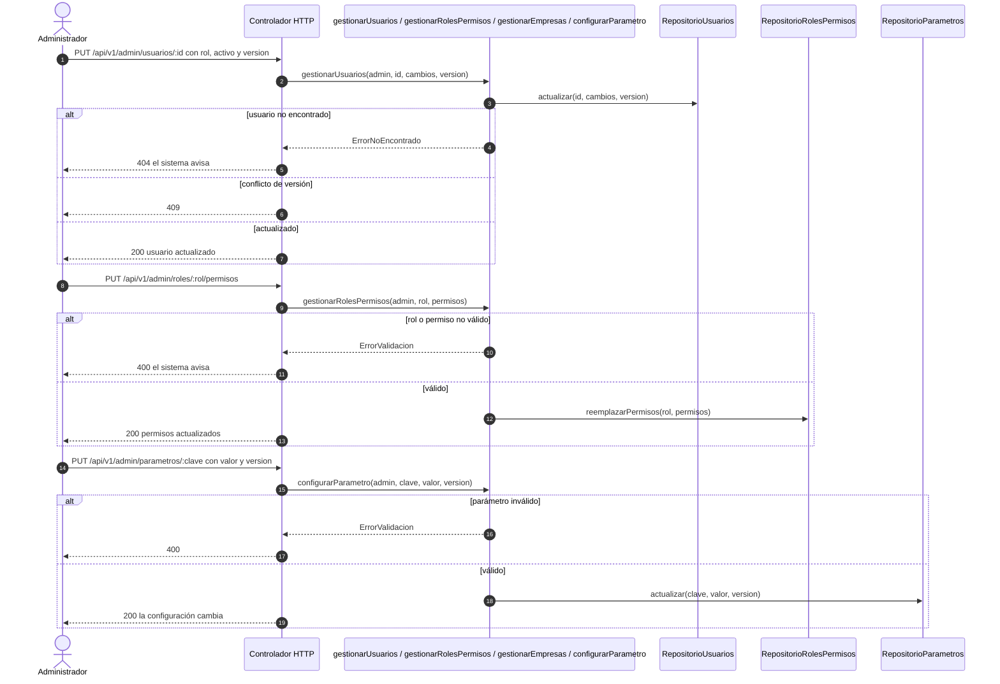
```mermaid
sequenceDiagram
    autonumber
    actor A as Administrador
    participant API as Controlador HTTP
    participant CU as gestionarUsuarios / gestionarRolesPermisos / gestionarEmpresas / configurarParametro
    participant RU as RepositorioUsuarios
    participant RRP as RepositorioRolesPermisos
    participant RPA as RepositorioParametros

    A->>API: PUT /api/v1/admin/usuarios/:id con rol, activo y version
    API->>CU: gestionarUsuarios(admin, id, cambios, version)
    CU->>RU: actualizar(id, cambios, version)
    alt usuario no encontrado
        CU-->>API: ErrorNoEncontrado
        API-->>A: 404 el sistema avisa
    else conflicto de versión
        API-->>A: 409
    else actualizado
        API-->>A: 200 usuario actualizado
    end

    A->>API: PUT /api/v1/admin/roles/:rol/permisos
    API->>CU: gestionarRolesPermisos(admin, rol, permisos)
    alt rol o permiso no válido
        CU-->>API: ErrorValidacion
        API-->>A: 400 el sistema avisa
    else válido
        CU->>RRP: reemplazarPermisos(rol, permisos)
        API-->>A: 200 permisos actualizados
    end

    A->>API: PUT /api/v1/admin/parametros/:clave con valor y version
    API->>CU: configurarParametro(admin, clave, valor, version)
    alt parámetro inválido
        CU-->>API: ErrorValidacion
        API-->>A: 400
    else válido
        CU->>RPA: actualizar(clave, valor, version)
        API-->>A: 200 la configuración cambia
    end
```

### S15. Estadísticas básicas de uso (HU-J06)

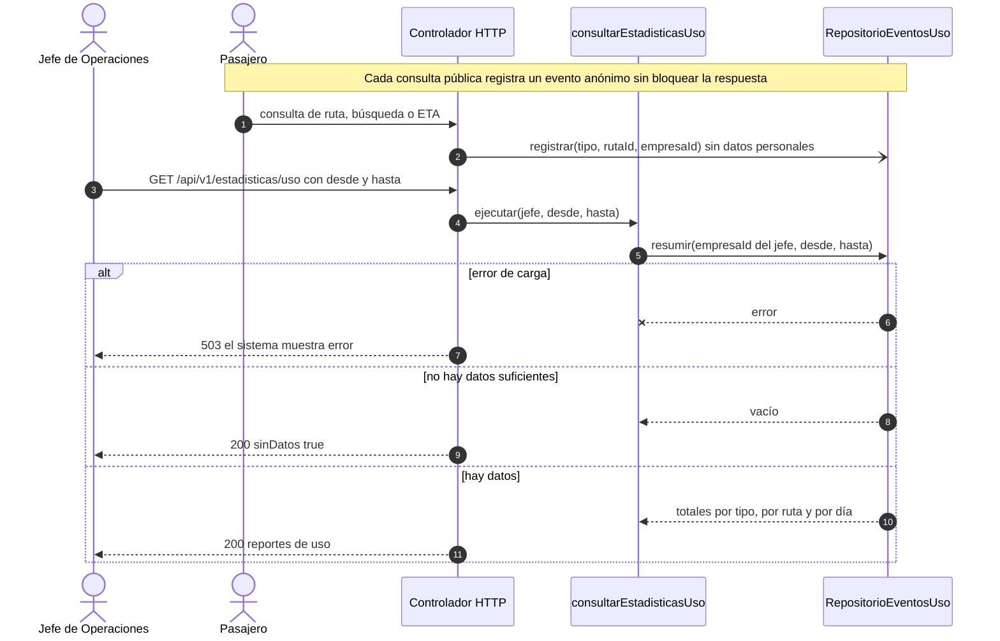
```mermaid
sequenceDiagram
    autonumber
    actor J as Jefe de Operaciones
    actor P as Pasajero
    participant API as Controlador HTTP
    participant CU as consultarEstadisticasUso
    participant RE as RepositorioEventosUso

    Note over P,RE: Cada consulta pública registra un evento anónimo sin bloquear la respuesta
    P->>API: consulta de ruta, búsqueda o ETA
    API-)RE: registrar(tipo, rutaId, empresaId) sin datos personales

    J->>API: GET /api/v1/estadisticas/uso con desde y hasta
    API->>CU: ejecutar(jefe, desde, hasta)
    CU->>RE: resumir(empresaId del jefe, desde, hasta)
    alt error de carga
        RE--xCU: error
        API-->>J: 503 el sistema muestra error
    else no hay datos suficientes
        RE-->>CU: vacío
        API-->>J: 200 sinDatos true
    else hay datos
        RE-->>CU: totales por tipo, por ruta y por día
        API-->>J: 200 reportes de uso
    end
```

---

## 13. Seguridad, concurrencia, logs y configuración

### 13.1 Autorización

- **Middleware** `exigirRol([...])` en cada ruta (matriz de la sección 9.2). Cada caso de uso de operación **vuelve a comprobar** que el recurso pertenece a `empresaId` del jefe (nunca confiar solo en el middleware).
- Nunca confiar en `empresaId` ni `rol` que vengan en el cuerpo: se toman del perfil verificado.
- Token de dispositivo: se genera aleatorio de al menos 32 bytes, se muestra una sola vez y solo se guarda su hash.
- `helmet`, `cors` con lista blanca (`CORS_ORIGENES`), límite de tasa en rutas públicas (valor inicial sugerido: 120 peticiones por minuto por IP) y en la ingesta (1 cada 2 s por token).
- Excel: solo `.xlsx`, tamaño máximo `tamano_max_excel_mb`, máximo `max_filas_excel` filas. No ejecutar macros ni leer fórmulas externas.

### 13.2 Control de concurrencia (RNF-02)

Todo recurso editable tiene `version integer`. Patrón obligatorio en los repositorios:

```text
update <tabla> set ..., version = version + 1 where id = :id and version = :versionEsperada
  0 filas afectadas y el registro existe     -> ErrorConflictoVersion (409, detalles: versión actual)
  0 filas afectadas y el registro no existe  -> ErrorNoEncontrado (404)
```

Las operaciones de varios pasos usan funciones SQL (sección 8.3), porque `supabase-js` no ofrece transacciones.

### 13.3 Logs (RNF-01)

`pino` con `redact` de: `req.headers.authorization`, `req.headers["x-token-dispositivo"]`, `*.correo`, `*.token`, `*.claves`, `*.password`. Cada log lleva `idPeticion`. No se registran cuerpos de petición completos.

### 13.4 Variables de entorno (`.env.example`; nunca subir `.env` al repositorio)

| Variable | Uso |
|---|---|
| `PORT` | Puerto HTTP |
| `SUPABASE_URL` | URL del proyecto |
| `SUPABASE_SERVICE_ROLE_KEY` | Clave de servidor. **Secreta** |
| `CORS_ORIGENES` | Orígenes del frontend, separados por coma |
| `VAPID_PUBLIC_KEY`, `VAPID_PRIVATE_KEY`, `VAPID_SUBJECT` | Web Push |
| `NOMINATIM_URL`, `NOMINATIM_USER_AGENT` | Geocodificación |
| `NIVEL_LOG` | `info`, `debug`… |
| `SIMULADOR_GPS_ACTIVO` | `true` solo en demo |

---

## 14. Patrones de diseño y justificación

| Patrón | Problema que resuelve | Dónde se aplica |
|---|---|---|
| Repository | Aislar la lógica de negocio de las consultas a Supabase | Puertos de repositorio (`dominio/puertos`) e implementación en `infraestructura/salida/supabase` |
| Adapter | Los externos (Excel, Nominatim, Web Push, Supabase Auth) tienen formas incompatibles con el dominio | `infraestructura/salida/*` |
| Observer | Avisar al pasajero cuando la buseta se acerca sin que el cliente consulte constantemente | `EmisorEventos` en memoria, con `EvaluadorAlertas` como suscriptor del evento `posicion_registrada`. **Límite:** solo funciona con una instancia (D-12). Con varias instancias hay que cambiarlo por Realtime o una cola |
| DTO | Desacoplar la API de las entidades y del esquema de Supabase | `aplicacion/dtos` y esquemas zod |
| Dependency Injection | Probar casos de uso con repositorios en memoria | `composicion.js` |
| Strategy (ligero) | Dos fuentes de ETA (`gps` y `horario`) con la misma interfaz | Dentro de `CalculadorEta` |

---

## 15. Registros de decisión de arquitectura (ADR)

### ADR-001: Arquitectura hexagonal ligera sobre monolito modular (propuesta)

- **Contexto:** cuatro perfiles, externos reemplazables (Supabase, mapas, push, Excel, fuente GPS), restricción de tecnologías gratuitas y equipo con experiencia desconocida en hexagonal.
- **Alternativas comparadas** (valoración del revisor de 1 a 5, el equipo debe validarla):

| Criterio | A. Hexagonal ligera (elegida) | B. Monolito en capas sin puertos | C. Frontend directo a Supabase (RLS + rpc) | D. Microservicios |
|---|---|---|---|---|
| Mantenibilidad | 5 | 3 | 3 | 3 |
| Testabilidad de ETA, planificación y alertas | 5 | 2 | 2 | 4 |
| Velocidad de entrega del prototipo | 3 | 4 | 5 | 1 |
| Cambiar de proveedor (geocodificación, push, GPS) | 5 | 2 | 2 | 4 |
| Costo operativo (gratuito) | 5 | 5 | 5 | 2 |
| Cubre ETA, planificación, Excel y alertas del lado servidor | 5 | 5 | 2 (requeriría Edge Functions) | 5 |
| Riesgo técnico | 3 | 4 | 3 | 2 |

- **Decisión:** A. **Condición:** puertos solo donde hay un externo o una lógica que probar. Las consultas de lectura simples pueden ir directo del caso de uso al repositorio sin servicios de dominio intermedios.
- **Por qué no D:** la complejidad operativa de varios servicios no se justifica en un prototipo con una sola instancia. **Por qué no C:** la planificación con transbordo, el ETA, la importación de Excel y las alertas requieren lógica de servidor, y el proyecto exige desarrollar un backend.
- **Consecuencias (+):** casos de uso probables sin infraestructura; cambio de proveedores localizado. **(−):** más archivos y una curva de aprendizaje inicial.
- **Riesgo:** sobreingeniería. Mitigación: la regla de "puertos solo con externo real".

### ADR-002: Supabase (Postgres + PostGIS + Auth) como única base de datos (propuesta)

- **Decisión:** usar Postgres de Supabase con PostGIS para lo espacial, Supabase Auth para identidad, y el backend como único cliente con `service_role` (RLS sin políticas).
- **Por qué:** el modelo es relacional, "paradero más cercano" y "rutas por hito" son consultas espaciales nativas de PostGIS, y es gratuito.
- **Consecuencias:** sin SLA ni garantía de disponibilidad en el plan gratuito. Consultas espaciales y transacciones vía funciones SQL. **Pendiente:** confirmar en la documentación vigente que el plan gratuito incluye PostGIS y cuáles son sus límites.

### ADR-003: Fuente de posiciones GPS: endpoint de ingesta con token de dispositivo (propuesta)

- **Contexto:** BR-06 impide que los conductores usen la plataforma, y no hay GPS de pago.
- **Decisión:** `POST /ingesta/posiciones` autenticado con token por buseta. En el prototipo lo alimenta un **simulador** que recorre el trazado de las rutas. La fuente real (teléfono del conductor con una página mínima, GPS barato, etc.) queda **fuera de este backend** y solo debe llamar al endpoint.
- **Consecuencias:** el mayor riesgo del proyecto (el origen real del dato) queda aislado y no bloquea el backend. **El equipo debe decidir la fuente real antes de producción.**

### ADR-004: Tiempo real por polling a 5 s (propuesta)

- **Decisión:** el cliente consulta `GET /rutas/:id/busetas` cada 5 s. No se usa Realtime en el prototipo.
- **Por qué:** menos piezas, sin límite de conexiones concurrentes de Realtime en el plan gratuito, y cumple el valor ajustado de 5 s (D-06). Una fase 2 puede agregar Realtime sobre `posicion_buseta`.

### ADR-005: Mapas y geocodificación (propuesta)

- **Decisión:** las teselas las dibuja el frontend (OpenStreetMap). El backend entrega GeoJSON. La búsqueda de lugares usa primero la tabla `hito` y, si no hay coincidencia, Nominatim detrás de `PuertoGeocodificacion`.
- **Consecuencia:** Nominatim tiene política de uso estricta (1 petición por segundo, `User-Agent` propio, cache). Suficiente para el prototipo. Para producción conviene alojar el servicio o cambiar de proveedor sin tocar el dominio.

### ADR-006: Hosting del backend (por decidir)

- **Opciones gratuitas habituales** (Render, Railway, Fly.io o similares): verificar condiciones vigentes. Suelen dormir el proceso tras inactividad (arranque en frío).
- **Decisión pendiente del equipo.** Requisito: una sola instancia y HTTPS. Mitigación del arranque en frío: ping periódico a `/salud`.

### ADR-007: Planificación de viaje con algoritmo propio sobre grafo en memoria (propuesta)

- **Contexto:** las APIs gratuitas de rutas (como OSRM) calculan rutas por calles, no por líneas de buseta.
- **Decisión:** algoritmo propio (sección 11.2) sobre el grafo ruta–parada cargado en memoria, con máximo 1 transbordo. Es lógica de dominio pura y por eso se prueba con datos en memoria.

---

## 16. Trazabilidad completa

| Historia | Requisito | Criterio | Endpoint | Caso de uso | Tablas principales | Diagrama |
|---|---|---|---|---|---|---|
| HU-P01 | RF-001-01 | AC-001-01 | E-01, E-07 | consultarRutasCercanas | ruta, parada, ruta_parada | S1 |
| HU-P02 | RF-001-02 | AC-001-02 | E-02 | obtenerDetalleRuta | ruta, ruta_parada | S2 |
| HU-P03 | RF-002-01 | AC-002-01 | E-03 | consultarHorarios | horario | S2 |
| HU-P04 | RF-002-02 | AC-002-02 | E-04 | consultarFrecuencias | frecuencia | S2 |
| HU-P05 | RF-003-01 | AC-003-01 | E-05, E-30 | consultarBusetasEnVivo, registrarPosicion | posicion_buseta, buseta, asignacion | S4, S5 |
| HU-P06 | RF-003-02 | AC-003-02 | E-06 | calcularEtaParada | posicion_buseta, ruta_parada, frecuencia | S5 |
| HU-P07 | RF-004-01 | AC-004-01 | E-08 | planificarViaje | ruta, ruta_parada, parada, hito | S6 |
| HU-P08 | RF-005-01 | AC-005-01 | E-09 | buscarRutasPorTexto | ruta | S3 |
| HU-P09 | RF-005-02 | AC-005-02 | E-10, E-11 | buscarHitos, consultarRutasPorHito | hito, ruta | S3 |
| HU-P10 | RF-008-01 | AC-008-01 | E-20, E-21, E-22 | agregarFavorito, listarFavoritos, quitarFavorito | favorito | S7 |
| HU-P11 | RF-009-01 | AC-009-01 | E-23, E-24, E-25, E-26 | crearAlertaLlegada, registrarSuscripcionPush, EvaluadorAlertas | alerta_llegada, suscripcion_push, notificacion | S4, S8 |
| HU-P12 | RF-010-01 | AC-010-01 | Endpoints públicos (E-01 a E-13) | — (sin autenticación) | — | S7 |
| HU-J01 | RF-006-01 | AC-006-01 | E-40, E-41, E-42 | asignarRecursos | asignacion, buseta, conductor | S11 |
| HU-J02 | RF-006-02 | AC-006-02 | E-43, E-44 | actualizarHorariosRuta, actualizarFrecuenciasRuta | horario, frecuencia | S12 (patrón) |
| HU-J03 | RF-006-03 | AC-006-03 | E-45 | importarDesdeExcel | conductor, buseta, importacion_excel | S10 |
| HU-J04 | RF-006-04 | AC-006-04 | E-47, E-48, E-49 | crearRodamiento, actualizarRodamiento, publicarRodamiento | rodamiento, turno_rodamiento | S11 |
| HU-J05 | RF-011-01 | AC-011-01 | E-51, E-12 | publicarAviso | aviso | S13 |
| HU-J06 | RF-012-01 | AC-012-01 | E-50 | consultarEstadisticasUso | evento_uso | S15 |
| HU-SM01 | RF-007-01 | AC-007-01 | E-60, E-66, E-67 | registrarRuta | ruta, ruta_parada | S12 (patrón), S10 |
| HU-SM02 | RF-007-02 | AC-007-02 | E-61 | editarRuta | ruta | S12 |
| HU-SM03 | RF-007-03 | AC-007-03 | E-62 | eliminarRuta | ruta, asignacion | S12 |
| HU-SM04 | RF-007-04 | AC-007-04 | E-63, E-64, E-65 | crearParada, editarParada, eliminarParada | parada | S12 (patrón) |
| HU-SM05 | RF-007-05 | AC-007-05 | E-51 | publicarAviso (tipo cambio_movilidad) | aviso, aviso_afectacion | S13 |
| HU-A01 | RF-013-01 | AC-013-01 | E-70 | gestionarUsuarios | perfil | S14 |
| HU-A02 | RF-013-02 | AC-013-02 | E-71 | gestionarRolesPermisos | rol_permiso, permiso | S14 |
| HU-A03 | RF-013-03 | AC-013-03 | E-72 | gestionarEmpresas | empresa | S14 |
| HU-A04 | RF-013-04 | AC-013-04 | E-73 | configurarParametro | parametro_global | S14 |
| HU-A05 | RF-013-05 | AC-013-05 | E-51 | publicarAviso (tipo mantenimiento) | aviso | S13 |

### Trazabilidad de drivers a decisiones

| Driver | Decisión | Dónde |
|---|---|---|
| Rendimiento (1 a 2.5 s) | Funciones SQL espaciales con índices GIST, grafo de planificación en memoria con cache de 60 s, una sola fila por buseta en posiciones | Secciones 8 y 11 |
| Actualización (5 s en GPS) | Ping GPS cada 5 s y polling de 5 s (D-06) | ADR-004 |
| Integridad | Versión optimista y funciones SQL transaccionales | Sección 13.2 |
| Seguridad | Auth de Supabase, roles en middleware y caso de uso, hash del token de dispositivo, RLS cerrado, `redact` en logs | Secciones 8.4 y 13 |
| Compatibilidad | API JSON agnóstica del cliente, web responsive (D-10) | Sección 9 |
| Restricción de costo | Solo componentes gratuitos o de código abierto | Sección 4 |
| Disponibilidad | Best-effort en el prototipo (sin SLA) | Sección 5 |

---

## 17. Orden de construcción y criterios de terminado

**Orden recomendado** (cada paso con sus pruebas unitarias antes de seguir):

1. **Esqueleto:** `package.json`, `app.js`, `servidor.js`, `composicion.js`, `/salud`, configuración de `pino` y manejo de errores (`dominio/errores.js` más middleware).
2. **Base de datos:** migraciones 0001 a 0004 y semillas (parámetros, permisos, datos de demo).
3. **Autenticación y roles:** `PuertoAutenticacion`, middlewares `autenticar` y `exigirRol` (S9).
4. **Consultas públicas:** E-01 a E-04, E-07, E-09 a E-12 (S1, S2, S3).
5. **Seguimiento:** E-30 (ingesta), E-05, E-06, `CalculadorEta` y simulador GPS (S4, S5).
6. **Planificación:** `PlanificadorViaje`, `PuertoGeocodificacion`, E-08 (S6).
7. **Pasajero:** favoritos, suscripciones push, alertas y `EvaluadorAlertas` (S7, S8).
8. **Secretaría:** rutas, paraderos, avisos de movilidad e importación de rutas (S10, S12, S13).
9. **Jefe de operaciones:** conductores y busetas por Excel, asignaciones, horarios, frecuencias, rodamiento, token de dispositivo (S10, S11).
10. **Administrador:** usuarios, roles, empresas, parámetros (S14).
11. **Estadísticas:** registro de eventos y E-50 (S15).

**Definición de terminado de cada historia:**
- Casos de uso con pruebas unitarias que cubren flujo normal, **flujo alternativo y flujo de excepción** de la SPEC.
- Endpoint con prueba de integración (incluye el caso 401 o 403 donde aplique).
- Contrato idéntico a la sección 9 (nombres, códigos de error).
- Sin datos personales en logs.
- Trazabilidad actualizada si algo cambió.

---

## 18. Riesgos, supuestos y preguntas abiertas

### Riesgos
- **Fuente real de GPS sin definir (ADR-003).** Es el principal riesgo del proyecto. El prototipo se demuestra con simulador.
- **Plan gratuito de Supabase:** sin SLA, posible pausa por inactividad y límites de tamaño o conexiones. Verificar condiciones vigentes.
- **Arranque en frío del hosting gratuito** vs. requisito de 1 s (sección 5).
- **Calidad de los datos de rutas:** el trazado y las paradas dependen de lo que entregue la Secretaría. Las rutas lineales (D-07) pueden no representar las rutas circulares reales.
- **Calidad del ETA:** simple (velocidad constante o reportada). No considera tráfico.
- **Nominatim:** política de uso estricta, no apto para carga alta.
- **SPEC sin aprobar:** SPEC-005 a 013 no están aprobadas formalmente y HU-J06 no existe en el archivo de historias.
- **Curva de aprendizaje de hexagonal** si el equipo no la ha usado (mitigación: regla de puertos solo con externo real).

### Supuestos
- La Secretaría de Movilidad entrega rutas, paradas y trazados, y las empresas entregan horarios, frecuencias, conductores y busetas (BR-08, OPEN-Q-001).
- Hay un respaldo cuando el GPS falla (respuesta de OPEN-Q-001, implementado como ETA por horario).
- El prototipo corre en **una sola instancia**.
- El frontend se desarrolla aparte y consume esta API.

### Preguntas abiertas (para el equipo)
1. **¿Confirman D-02 y D-03** (solo la Secretaría gestiona rutas y paraderos, y el Excel se divide en tres tipos)?
2. **¿De dónde saldrá el GPS real** de las busetas (ADR-003)?
3. **¿Cuál es el valor correcto** de disponibilidad de SPEC-001 (¿99 %?) y aceptan los RNF ajustados de la sección 5?
4. **¿Qué hosting gratuito** se usará (ADR-006)?
5. **¿Existe la historia HU-J06?** Falta en el archivo de historias.
6. ¿Aprueban los **parámetros iniciales** de la sección 8.5?
7. ¿Qué nivel de experiencia previa tiene el equipo con arquitectura hexagonal?
8. ¿Las rutas reales son lineales (ida y vuelta) o hay circulares (D-07)?

---

## 19. Validación humana y defensa técnica

La IA propone, **el equipo decide y debe poder defender** cada decisión sin depender de la IA (guía §19, §22 y §23). Para la defensa, el equipo debería poder responder:

- **¿Qué requisito condicionó más la arquitectura?** La combinación de datos en vivo (GPS y ETA) con restricción de costo cero y varios roles con reglas distintas.
- **¿Qué alternativas consideraron y por qué descartaron las otras?** ADR-001 (monolito sin puertos, frontend directo a Supabase y microservicios).
- **¿Qué trade-off aceptaron?** Más estructura inicial a cambio de testabilidad y reemplazo de proveedores. Disponibilidad best-effort y polling de 5 s a cambio de costo cero.
- **¿Qué problema concreto justifica cada patrón?** Sección 14.
- **¿Qué recomendación de la IA rechazaron o corrigieron?** Los RNF copiados sin cuestionar, el ER con `BOLETO`, la fuente GPS sin definir y el Observer sin límite documentado (sección 1.1).
- **¿Qué cambiaría si la carga aumenta?** Realtime o cola de mensajes en lugar del Observer en memoria, varias instancias, caché externo para el grafo, geocodificación propia y plan de pago de la base de datos.
- **¿Dónde están los principales riesgos técnicos?** Sección 18.

### Qué debe hacer el equipo con este documento
| IA propone | Equipo debe |
|---|---|
| Decisiones D-01 a D-15 | Confirmarlas, corregirlas o rechazarlas una por una |
| RNF ajustados (sección 5) | Validar valores y justificación |
| Modelo de datos y API | Revisar coherencia con las SPEC y el frontend |
| Parámetros iniciales | Ajustarlos con datos reales de Manizales |
| Riesgos detectados | Confirmar cuáles aplican |

---

## 20. Anexo: origen de este documento

- **Base:** `informe_arquitectura (1).md` (Architecture Agent, proveedor gemini, 2026-10-12 23:47, puntaje 5/5, sin alternativas evaluadas) y las SPEC-001 a SPEC-013 (7 aprobadas formalmente, 1 con estado inválido, 5 en borrador o con estado inconsistente).
- **Revisión (2026-10-13):** contraste con las SPEC y las historias de usuario, corrección del modelo de datos y de los diagramas, y especificación de contrato, algoritmos y secuencias para el desarrollo del backend.
- **Aviso:** documento generado con asistencia de IA. Es una recomendación técnica **pendiente de aprobación humana**, no una decisión del equipo.
